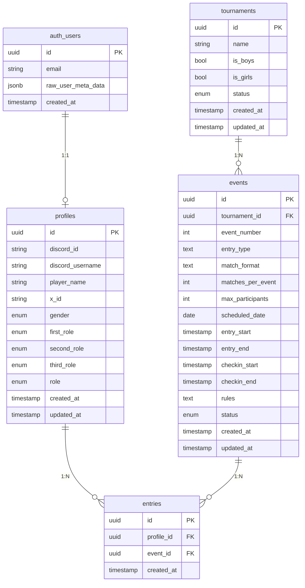

# データベース設計書

## 概要

本ドキュメントは「Jiro-Rimi Cup」のデータベース設計を定義する。Supabase（PostgreSQL）を使用し、Phase 1で必要なテーブルを設計する。

## ER図（Phase 1）



## テーブル定義

### profiles（ユーザープロフィール）

Supabase Auth の `auth.users` と 1:1 で紐づくプロフィール情報。

| カラム名 | 型 | NULL | デフォルト | 説明 |
|---------|------|------|-----------|------|
| id | uuid | NO | - | PK, auth.users.id への FK |
| discord_id | text | NO | - | Discord ユーザーID（認証から自動取得）, UK |
| discord_username | text | YES | NULL | Discord ユーザー名（表示用） |
| player_name | text | YES | NULL | ゲーム内プレイヤー名 |
| x_id | text | NO | - | X (Twitter) ID（必須） |
| gender | text | YES | NULL | 性別（後述） |
| first_role | text | YES | NULL | 第1希望ロール（後述） |
| second_role | text | YES | NULL | 第2希望ロール（後述） |
| third_role | text | YES | NULL | 第3希望ロール（後述） |
| role | text | NO | 'user' | ユーザー権限（後述） |
| created_at | timestamptz | NO | now() | 作成日時 |
| updated_at | timestamptz | NO | now() | 更新日時 |

**性別 (gender)**:
- `boys`: ボーイズ
- `girls`: ガールズ

**ゲーム内ロール (first_role, second_role, third_role)**:
- `top_carry`: 上キャリー
- `bot_carry`: 下キャリー
- `mid`: 中央
- `tank`: タンク
- `support`: サポート

**ユーザー権限 (role)**:
- `user`: 一般ユーザー
- `admin`: 運営者

**制約**:
- `discord_id` はユニーク
- `first_role`, `second_role`, `third_role` は互いに重複不可（アプリ側でバリデーション）

---

### tournaments（大会）

大会は複数のイベントを束ねるコンテナであり、大会自体の設定は最小限に留める（詳細は「設計思想」セクションを参照）。

| カラム名 | 型 | NULL | デフォルト | 説明 |
|---------|------|------|-----------|------|
| id | uuid | NO | gen_random_uuid() | PK |
| name | text | NO | - | 大会名 |
| is_boys | boolean | NO | false | じろカップ（Boys）対象 |
| is_girls | boolean | NO | false | りみカップ（Girls）対象 |
| status | text | NO | 'draft' | ステータス（後述） |
| created_at | timestamptz | NO | now() | 作成日時 |
| updated_at | timestamptz | NO | now() | 更新日時 |

**カテゴリ (is_boys, is_girls)**:
| is_boys | is_girls | カテゴリ |
|---------|----------|----------|
| true | false | じろカップ（Boys） |
| false | true | りみカップ（Girls） |
| true | true | Jiro-Rimi Cup（Boys & Girls） |

**制約**: `CHECK (is_boys OR is_girls)` — 両方 false は不可

**ステータス (status)**:
- `draft`: 下書き（非公開）
- `open`: 公開中（エントリー受付可能）
- `in_progress`: 進行中
- `completed`: 終了

---

### events（イベント）

大会の構成単位。試合形式・エントリー方式・試合数など、運営に必要な設定はすべてイベント側に持たせる（詳細は「設計思想」セクションを参照）。

| カラム名 | 型 | NULL | デフォルト | 説明 |
|---------|------|------|-----------|------|
| id | uuid | NO | gen_random_uuid() | PK |
| tournament_id | uuid | NO | - | FK → tournaments.id |
| event_number | int | NO | - | イベント番号（大会内での連番） |
| entry_type | text | NO | 'open' | エントリー方式（後述） |
| match_format | text | NO | 'swiss' | 進行形式（後述） |
| matches_per_event | int | NO | 5 | 試合数 |
| max_participants | int | YES | NULL | 参加上限人数（NULL=無制限） |
| scheduled_date | date | NO | - | 開催日 |
| entry_start | timestamptz | NO | - | エントリー開始日時 |
| entry_end | timestamptz | NO | - | エントリー締切日時 |
| checkin_start | timestamptz | NO | - | チェックイン開始時刻 |
| checkin_end | timestamptz | NO | - | チェックイン締切時刻 |
| rules | text | YES | NULL | ルール（自由記載） |
| status | text | NO | 'scheduled' | ステータス（後述） |
| created_at | timestamptz | NO | now() | 作成日時 |
| updated_at | timestamptz | NO | now() | 更新日時 |

**エントリー方式 (entry_type)**:
- `open`: オープン参加（誰でもエントリー可能）
- `invite`: 招待制（運営者が招待したユーザーのみ参加可能）

**進行形式 (match_format)**:
- `swiss`: スイスドロー
- `double_elimination`: ダブルエリミネーション
- `single_elimination`: シングルエリミネーション
- `round_robin`: ラウンドロビン

**ステータス (status)**:
- `scheduled`: 予定（エントリー開始前）
- `entry_open`: エントリー受付中
- `entry_closed`: エントリー締切済
- `checkin_open`: チェックイン受付中
- `participants_confirmed`: 参加者確定
- `in_progress`: 試合進行中
- `completed`: 終了

**ユニーク制約**: (tournament_id, event_number)

**時系列制約**: `entry_start < entry_end <= checkin_start < checkin_end`

---

### entries（エントリー）

| カラム名 | 型 | NULL | デフォルト | 説明 |
|---------|------|------|-----------|------|
| id | uuid | NO | gen_random_uuid() | PK |
| profile_id | uuid | NO | - | FK → profiles.id |
| event_id | uuid | NO | - | FK → events.id |
| created_at | timestamptz | NO | now() | エントリー日時 |

**ユニーク制約**: (profile_id, event_id) - 同一ユーザーは同一イベントに1回のみエントリー可能

**インデックス**:
- `entries_event_id_idx` on (event_id)

---

## Phase 2 以降で追加予定のテーブル（概要）

### Phase 2: イベント進行関連

| テーブル名 | 用途 |
|-----------|------|
| check_ins | チェックイン情報（ユーザー×イベント） |
| matches | 試合情報（チーム構成、ロビー番号、ステータス） |
| match_participants | 試合参加者（マッチ×ユーザー、チーム割り当て） |
| match_results | 試合結果（個人入力、多数決結果、確定結果） |

### Phase 3: 招待制イベント対応

招待制（`entry_type = 'invite'`）のイベントに必要なテーブル。GF（グランドファイナル）はこの仕組みの上に構築する。

| テーブル名 | 用途 |
|-----------|------|
| event_invitations | イベントへの招待（運営者が対象ユーザーを指定） |

GF固有のチーム編成・ブラケット管理は Phase 3 の詳細設計時に決定する。

---

## 設計思想

### イベント中心モデル

本アプリケーションのDB設計は「イベント中心モデル」を採用する。

**大会（Tournament）はイベントのコンテナ**であり、試合形式・エントリー方式・試合数・参加上限などの運営設定はすべて **イベント（Event）側** に持たせる。アプリケーションに「予選」「本戦」「グランドファイナル」といった専用の概念は設けず、それらはイベントの設定値（`entry_type`、`match_format`）の組み合わせとして表現される。

```
Tournament（コンテナ）
├── Event 1: open / swiss           ← 実質「予選」
├── Event 2: open / swiss           ← 実質「予選」
└── Event 3: invite / double_elim   ← 実質「グランドファイナル」
```

#### イベントの性質を決める2つの軸

| 軸 | カラム | 値 | 説明 |
|----|--------|-----|------|
| 参加方式 | `entry_type` | `open` / `invite` | 誰でも参加 or 招待制 |
| 進行形式 | `match_format` | `swiss` / `double_elimination` / ... | 試合の進め方 |

#### 典型的な大会構成

| 大会形式 | イベント構成 |
|---------|------------|
| 予選 + GF | Event 1-N: `open` / `swiss` → GF: `invite` / `double_elimination` |
| 本戦のみ（1日大会） | Event 1: `open` / `swiss` |

#### この設計の利点

1. **汎用性**: 「予選」「GF」などの概念をハードコードせず、イベントの設定値の組み合わせで表現する。新しい大会形式を追加する際にスキーマ変更が不要
2. **招待制による参加者管理**: GF進出者の管理を `gf_advance_count` のような専用カラムではなく、招待制（`entry_type = 'invite'`）という汎用的な仕組みで実現する。運営者が成績に基づいて招待するか、将来的に自動選出するかは実装の問題であり、データモデルには影響しない
3. **シンプルなコンテナ**: 大会（Tournament）は名前・カテゴリといった最小限の共通情報のみを持ち、ルール・試合数・参加上限など運営に関わる詳細はすべてイベント側に委譲する

---

## 設計上の考慮事項

### 1. Supabase Auth との連携

- `profiles` テーブルは `auth.users.id` を主キー兼外部キーとして使用
- Discord 認証時に `auth.users.raw_user_meta_data` から Discord 情報を取得可能
- 初回ログイン時に `profiles` レコードを自動作成する（トリガーまたはアプリ側で実装）

### 2. ロール優先順位の保存方法

個別カラム (`first_role`, `second_role`, `third_role`) で保存:
- スキーマが明確で型安全
- CHECK 制約で許可値を限定可能
- 重複チェックはアプリ側で実装

### 3. ステータス管理

ENUM 型ではなく TEXT + CHECK 制約を使用:
- マイグレーション時のステータス追加が容易
- Supabase との相性が良い

### 4. エントリーのキャンセル

物理削除で対応:
- 小規模アプリのため、シンプルさを優先
- キャンセル後の再エントリーも可能

### 5. プロフィール完了判定

アプリケーション側で以下の条件をチェック:
- `player_name` が設定されている
- `x_id` が設定されている
- `gender` が設定されている
- `first_role`, `second_role`, `third_role` がすべて設定されている

---

## 次のステップ

1. 本設計書のレビュー・承認
2. Supabase マイグレーションファイルの作成（1.1.4 完了）
3. Row Level Security (RLS) ポリシーの設計・実装（1.1.5）
