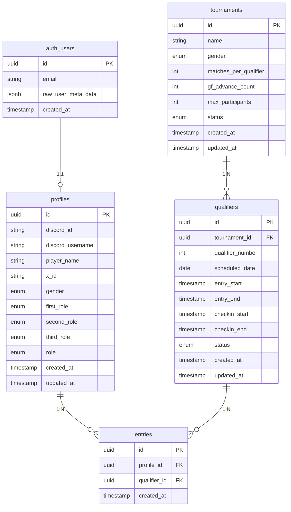

# データベース設計書

## 概要

本ドキュメントは「じろりみ」のデータベース設計を定義する。Supabase（PostgreSQL）を使用し、Phase 1で必要なテーブルを設計する。

## ER図（Phase 1）

## テーブル定義

### profiles（ユーザープロフィール）

Supabase Auth の `auth.users` と 1:1 で紐づくプロフィール情報。

| カラム名 | 型 | NULL | デフォルト | 説明 |
|---------|------|------|-----------|------|
| id | uuid | NO | - | PK, auth.users.id への FK |
| discord_id | text | NO | - | Discord ユーザーID（認証から自動取得）, UK |
| discord_username | text | YES | NULL | Discord ユーザー名（表示用） |
| player_name | text | YES | NULL | ゲーム内プレイヤー名 |
| x_id | text | NO | - | X (Twitter) ID（必須） |
| gender | text | YES | NULL | 性別（後述） |
| first_role | text | YES | NULL | 第1希望ロール（後述） |
| second_role | text | YES | NULL | 第2希望ロール（後述） |
| third_role | text | YES | NULL | 第3希望ロール（後述） |
| role | text | NO | 'user' | ユーザー権限（後述） |
| created_at | timestamptz | NO | now() | 作成日時 |
| updated_at | timestamptz | NO | now() | 更新日時 |

**性別 (gender)**:
- `boys`: ボーイズ
- `girls`: ガールズ

**ゲーム内ロール (first_role, second_role, third_role)**:
- `top_carry`: 上キャリー
- `bot_carry`: 下キャリー
- `mid`: 中央
- `tank`: タンク
- `support`: サポート

**ユーザー権限 (role)**:
- `user`: 一般ユーザー
- `admin`: 運営者

**制約**:
- `discord_id` はユニーク
- `first_role`, `second_role`, `third_role` は互いに重複不可（アプリ側でバリデーション）

---

### tournaments（大会）

| カラム名 | 型 | NULL | デフォルト | 説明 |
|---------|------|------|-----------|------|
| id | uuid | NO | gen_random_uuid() | PK |
| name | text | NO | - | 大会名 |
| gender | text | NO | - | 性別区分（後述） |
| matches_per_qualifier | int | NO | 5 | 1予選あたりの試合数 |
| gf_advance_count | int | NO | 20 | GF進出人数 |
| max_participants | int | YES | NULL | 参加上限人数（NULL=無制限） |
| status | text | NO | 'draft' | ステータス（後述） |
| created_at | timestamptz | NO | now() | 作成日時 |
| updated_at | timestamptz | NO | now() | 更新日時 |

**性別区分 (gender)**:
- `boys`: ボーイズ じろカップ
- `girls`: ガールズ りみカップ

**ステータス (status)**:
- `draft`: 下書き（非公開）
- `open`: 公開中（エントリー受付可能）
- `in_progress`: 進行中
- `completed`: 終了

---

### qualifiers（予選）

| カラム名 | 型 | NULL | デフォルト | 説明 |
|---------|------|------|-----------|------|
| id | uuid | NO | gen_random_uuid() | PK |
| tournament_id | uuid | NO | - | FK → tournaments.id |
| qualifier_number | int | NO | - | 予選回数（1, 2, 3...） |
| scheduled_date | date | NO | - | 開催日 |
| entry_start | timestamptz | NO | - | エントリー開始日時 |
| entry_end | timestamptz | NO | - | エントリー締切日時 |
| checkin_start | timestamptz | NO | - | チェックイン開始時刻 |
| checkin_end | timestamptz | NO | - | チェックイン締切時刻 |
| status | text | NO | 'scheduled' | ステータス（後述） |
| created_at | timestamptz | NO | now() | 作成日時 |
| updated_at | timestamptz | NO | now() | 更新日時 |

**ステータス (status)**:
- `scheduled`: 予定（エントリー開始前）
- `entry_open`: エントリー受付中
- `entry_closed`: エントリー締切済
- `checkin_open`: チェックイン受付中
- `participants_confirmed`: 参加者確定
- `in_progress`: 試合進行中
- `completed`: 予選終了

**ユニーク制約**: (tournament_id, qualifier_number)

**時系列制約**: `entry_start < entry_end <= checkin_start < checkin_end`

---

### entries（エントリー）

| カラム名 | 型 | NULL | デフォルト | 説明 |
|---------|------|------|-----------|------|
| id | uuid | NO | gen_random_uuid() | PK |
| profile_id | uuid | NO | - | FK → profiles.id |
| qualifier_id | uuid | NO | - | FK → qualifiers.id |
| created_at | timestamptz | NO | now() | エントリー日時 |

**ユニーク制約**: (profile_id, qualifier_id) - 同一ユーザーは同一予選に1回のみエントリー可能

**インデックス**:
- `entries_qualifier_id_idx` on (qualifier_id)

---

## Phase 2 以降で追加予定のテーブル（概要）

### Phase 2: 予選進行関連

| テーブル名 | 用途 |
|-----------|------|
| check_ins | チェックイン情報（ユーザー×予選） |
| matches | 試合情報（チーム構成、ロビー番号、ステータス） |
| match_participants | 試合参加者（マッチ×ユーザー、チーム割り当て） |
| match_results | 試合結果（個人入力、多数決結果、確定結果） |

### Phase 3: グランドファイナル関連

| テーブル名 | 用途 |
|-----------|------|
| gf_participants | GF進出者 |
| gf_teams | GFチーム（4チーム×5人） |
| gf_brackets | ダブルエリミネーションブラケット |
| gf_matches | GF試合情報 |

---

## 設計上の考慮事項

### 1. Supabase Auth との連携

- `profiles` テーブルは `auth.users.id` を主キー兼外部キーとして使用
- Discord 認証時に `auth.users.raw_user_meta_data` から Discord 情報を取得可能
- 初回ログイン時に `profiles` レコードを自動作成する（トリガーまたはアプリ側で実装）

### 2. ロール優先順位の保存方法

個別カラム (`first_role`, `second_role`, `third_role`) で保存:
- スキーマが明確で型安全
- CHECK 制約で許可値を限定可能
- 重複チェックはアプリ側で実装

### 3. ステータス管理

ENUM 型ではなく TEXT + CHECK 制約を使用:
- マイグレーション時のステータス追加が容易
- Supabase との相性が良い

### 4. エントリーのキャンセル

物理削除で対応:
- 小規模アプリのため、シンプルさを優先
- キャンセル後の再エントリーも可能

### 5. プロフィール完了判定

アプリケーション側で以下の条件をチェック:
- `player_name` が設定されている
- `x_id` が設定されている
- `gender` が設定されている
- `first_role`, `second_role`, `third_role` がすべて設定されている

---

## 次のステップ

1. 本設計書のレビュー・承認
2. Supabase マイグレーションファイルの作成（1.1.4 完了）
3. Row Level Security (RLS) ポリシーの設計・実装（1.1.5）
