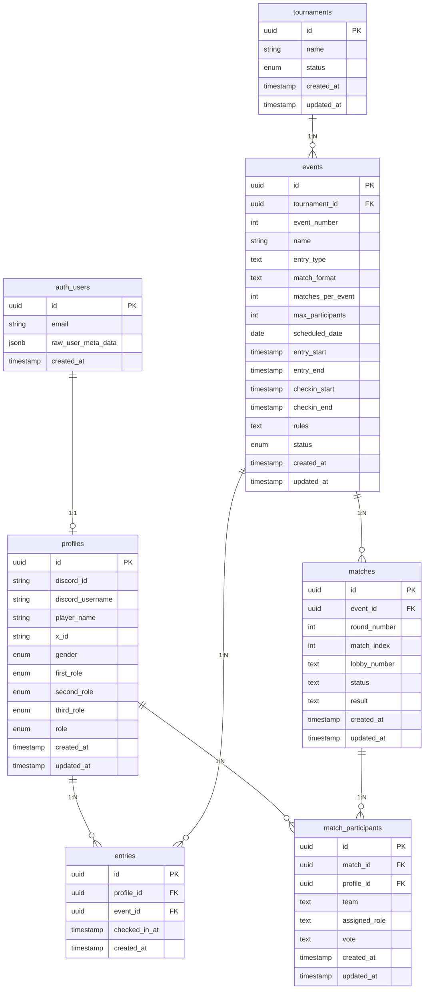

# データベース設計書

## 概要

本ドキュメントは「Jiro-Rimi Cup」のデータベース設計を定義する。Supabase（PostgreSQL）を使用する。

## ER図


```mermaid
erDiagram
    auth_users ||--o| profiles : "1:1"
    profiles ||--o{ entries : "1:N"
    profiles ||--o{ match_participants : "1:N"
    tournaments ||--o{ events : "1:N"
    events ||--o{ entries : "1:N"
    events ||--o{ matches : "1:N"
    matches ||--o{ match_participants : "1:N"

    auth_users {
        uuid id PK
        string email
        jsonb raw_user_meta_data
        timestamp created_at
    }

    profiles {
        uuid id PK
        string discord_id
        string discord_username
        string player_name
        string x_id
        enum gender
        enum first_role
        enum second_role
        enum third_role
        enum role
        timestamp created_at
        timestamp updated_at
    }

    tournaments {
        uuid id PK
        string name
        enum status
        timestamp created_at
        timestamp updated_at
    }

    events {
        uuid id PK
        uuid tournament_id FK
        int event_number
        string name
        text entry_type
        text match_format
        int matches_per_event
        int max_participants
        date scheduled_date
        timestamp entry_start
        timestamp entry_end
        timestamp checkin_start
        timestamp checkin_end
        text rules
        enum status
        timestamp created_at
        timestamp updated_at
    }

    entries {
        uuid id PK
        uuid profile_id FK
        uuid event_id FK
        timestamp checked_in_at
        timestamp created_at
    }

    matches {
        uuid id PK
        uuid event_id FK
        int round_number
        int match_index
        text lobby_number
        text status
        text result
        timestamp created_at
        timestamp updated_at
    }

    match_participants {
        uuid id PK
        uuid match_id FK
        uuid profile_id FK
        text team
        text assigned_role
        text vote
        timestamp created_at
        timestamp updated_at
    }
```

## テーブル定義

### profiles（ユーザープロフィール）

Supabase Auth の `auth.users` と 1:1 で紐づくプロフィール情報。

| カラム名 | 型 | NULL | デフォルト | 説明 |
|---------|------|------|-----------|------|
| id | uuid | NO | - | PK, auth.users.id への FK |
| discord_id | text | NO | - | Discord ユーザーID（認証から自動取得）, UK |
| discord_username | text | YES | NULL | Discord ユーザー名（表示用） |
| player_name | text | YES | NULL | ゲーム内プレイヤー名 |
| x_id | text | NO | - | X (Twitter) ID（必須） |
| gender | text | YES | NULL | 性別（後述） |
| first_role | text | YES | NULL | 第1希望ロール（後述） |
| second_role | text | YES | NULL | 第2希望ロール（後述） |
| third_role | text | YES | NULL | 第3希望ロール（後述） |
| role | text | NO | 'user' | ユーザー権限（後述） |
| created_at | timestamptz | NO | now() | 作成日時 |
| updated_at | timestamptz | NO | now() | 更新日時 |

**性別 (gender)**:
- `boys`: ボーイズ
- `girls`: ガールズ

**ゲーム内ロール (first_role, second_role, third_role)**:
- `top_carry`: 上キャリー
- `bot_carry`: 下キャリー
- `mid`: 中央
- `tank`: タンク
- `support`: サポート

**ユーザー権限 (role)**:
- `user`: 一般ユーザー
- `admin`: 運営者

**制約**:
- `discord_id` はユニーク
- `first_role`, `second_role`, `third_role` は互いに重複不可（アプリ側でバリデーション）

---

### tournaments（大会）

大会は複数のイベントを束ねるコンテナであり、大会自体の設定は最小限に留める（詳細は「設計思想」セクションを参照）。

| カラム名 | 型 | NULL | デフォルト | 説明 |
|---------|------|------|-----------|------|
| id | uuid | NO | gen_random_uuid() | PK |
| name | text | NO | - | 大会名 |
| status | text | NO | 'draft' | ステータス（後述） |
| created_at | timestamptz | NO | now() | 作成日時 |
| updated_at | timestamptz | NO | now() | 更新日時 |

**ステータス (status)**:
- `draft`: 下書き（非公開）
- `open`: 公開中（エントリー受付可能）
- `in_progress`: 進行中
- `completed`: 終了

---

### events（イベント）

大会の構成単位。試合形式・エントリー方式・試合数など、運営に必要な設定はすべてイベント側に持たせる（詳細は「設計思想」セクションを参照）。

| カラム名 | 型 | NULL | デフォルト | 説明 |
|---------|------|------|-----------|------|
| id | uuid | NO | gen_random_uuid() | PK |
| tournament_id | uuid | NO | - | FK → tournaments.id |
| event_number | int | NO | - | イベント番号（大会内での連番） |
| name | text | NO | - | イベント名（例: 予選1、グランドファイナル） |
| entry_type | text | NO | 'open' | エントリー方式（後述） |
| match_format | text | NO | 'qualifier' | 進行形式（後述） |
| matches_per_event | int | YES | NULL | 試合数（予選の場合のみ、1-10。ダブルエリミネーションはNULL） |
| max_participants | int | YES | NULL | 参加上限人数（NULL=無制限） |
| scheduled_date | date | NO | - | 開催日 |
| entry_start | timestamptz | NO | - | エントリー開始日時 |
| entry_end | timestamptz | NO | - | エントリー締切日時 |
| checkin_start | timestamptz | NO | - | チェックイン開始時刻 |
| checkin_end | timestamptz | NO | - | チェックイン締切時刻 |
| rules | text | YES | NULL | ルール（自由記載） |
| status | text | NO | 'scheduled' | ステータス（後述） |
| created_at | timestamptz | NO | now() | 作成日時 |
| updated_at | timestamptz | NO | now() | 更新日時 |

**エントリー方式 (entry_type)**:
- `open`: オープン参加（誰でもエントリー可能）
- `invite`: 招待制（運営者が招待したユーザーのみ参加可能）

**進行形式 (match_format)**:
- `qualifier`: 予選（試合数を1-10で指定）
- `double_elimination`: ダブルエリミネーション（試合数は自動決定、matches_per_event = NULL）

**CHECK制約**: `match_format` と `matches_per_event` の整合性を保証
- `qualifier` の場合: `matches_per_event` は NOT NULL かつ 1-10
- `double_elimination` の場合: `matches_per_event` は NULL

**ステータス (status)**:
- `scheduled`: 予定（デフォルト。試合開始前）
- `in_progress`: 試合進行中
- `completed`: 終了

> **Note**: エントリー受付中・エントリー締切済・チェックイン受付中などの時間ベースのフェーズは、`entry_start` / `entry_end` / `checkin_start` / `checkin_end` からアプリ層で算出する（後述「ステータス管理」セクション参照）。

**ユニーク制約**: (tournament_id, event_number)

**時系列制約**: `entry_start < entry_end <= checkin_start < checkin_end`

---

### entries（エントリー）

| カラム名 | 型 | NULL | デフォルト | 説明 |
|---------|------|------|-----------|------|
| id | uuid | NO | gen_random_uuid() | PK |
| profile_id | uuid | NO | - | FK → profiles.id |
| event_id | uuid | NO | - | FK → events.id |
| checked_in_at | timestamptz | YES | NULL | チェックイン日時（NULL=未チェックイン） |
| created_at | timestamptz | NO | now() | エントリー日時 |

**ユニーク制約**: (profile_id, event_id) - 同一ユーザーは同一イベントに1回のみエントリー可能

**インデックス**:
- `entries_event_id_idx` on (event_id)

**チェックイン判定**:
- `checked_in_at IS NOT NULL` → チェックイン済み
- `checked_in_at IS NULL` → 未チェックイン
- チェックイン操作 = `checked_in_at` に現在時刻を設定（UPDATE）
- チェックイン取り消し = 運営者が `checked_in_at` を NULL に戻す（UPDATE）

**設計判断**:
- チェックインをエントリーのライフサイクル（エントリー → チェックイン）として entries テーブルに統合
- 別テーブルにしない理由: エントリーとチェックインは1:1の関係であり、1カラムで「済みかどうか」と「いつチェックインしたか」の両方を表現できる
- 参加者自身によるチェックイン取り消しは不可（運営者が `checked_in_at` を NULL に戻す）
- チェックイン時間帯の制御: events テーブルの `checkin_start` / `checkin_end` を参照（RLS で強制）

---

### matches（マッチ）

イベント内の各試合（5v5マッチ）の情報。ラウンド（第N試合）× マッチ番号の2軸で管理する。

| カラム名 | 型 | NULL | デフォルト | 説明 |
|---------|------|------|-----------|------|
| id | uuid | NO | gen_random_uuid() | PK |
| event_id | uuid | NO | - | FK → events.id |
| round_number | int | NO | - | 試合番号（第何試合目か。1〜matches_per_event） |
| match_index | int | NO | - | ラウンド内マッチ番号（1〜N。N=参加者数÷10） |
| lobby_number | text | YES | NULL | ロビー番号（後勝ち方式） |
| status | text | NO | 'waiting' | マッチステータス（後述） |
| result | text | YES | NULL | 運営者確定結果（後述） |
| created_at | timestamptz | NO | now() | 作成日時 |
| updated_at | timestamptz | NO | now() | 更新日時 |

**マッチステータス (status)**:
- `waiting`: 待機中（チーム編成済み、試合開始前）
- `in_progress`: 進行中（試合開始〜運営者確定前）
- `confirmed`: 確定済（運営者が結果を確定）

**確定結果 (result)**:
- `team_a`: チームAの勝利
- `team_b`: チームBの勝利
- NULL: 未確定

**CHECK制約**:
- `status IN ('waiting', 'in_progress', 'confirmed')`
- `result IN ('team_a', 'team_b')`
- `round_number >= 1`
- `match_index >= 1`

**ユニーク制約**: (event_id, round_number, match_index)

**インデックス**:
- `matches_event_id_idx` on (event_id)

**設計判断**:
- `round_number` = 「第N試合」、`match_index` = 「ラウンド内のM番目のマッチ」の2軸で管理
- ラウンドテーブルを設けない理由: ラウンド単位の操作（一斉開始、一括確定）は WHERE 句で十分。テーブルを増やす複雑さに対してメリットが小さい
- 「試合開始」操作 = 同一ラウンドの全マッチを `waiting` → `in_progress` に一括更新
- 「結果確定」操作 = 同一ラウンドの全マッチを `in_progress` → `confirmed` に一括更新
- ロビー番号: マッチ単位で1つ。後勝ち方式のため、マッチ参加者なら誰でも上書き可能
- 仮結果（多数決）はDBに保存せず、`match_participants.vote` から都度算出（アプリ層）。保存すると vote との整合性管理が必要になり、参加者50人規模では算出コストも無視できる
- 試合開始前の対戦情報は RLS で非公開（運営者のみ閲覧可）

---

### match_participants（マッチ参加者）

マッチごとのチーム編成と個人の勝敗入力を管理する。チーム割り当て・ロール・勝敗投票を1テーブルに統合。

| カラム名 | 型 | NULL | デフォルト | 説明 |
|---------|------|------|-----------|------|
| id | uuid | NO | gen_random_uuid() | PK |
| match_id | uuid | NO | - | FK → matches.id |
| profile_id | uuid | NO | - | FK → profiles.id |
| team | text | NO | - | 所属チーム（後述） |
| assigned_role | text | YES | NULL | アサインされたロール（後述） |
| vote | text | YES | NULL | 個人の勝敗入力（後述） |
| created_at | timestamptz | NO | now() | 作成日時 |
| updated_at | timestamptz | NO | now() | 更新日時 |

**チーム (team)**:
- `team_a`
- `team_b`

**ロール (assigned_role)**:
- `top_carry`: 上キャリー
- `bot_carry`: 下キャリー
- `mid`: 中央
- `tank`: タンク
- `support`: サポート

**勝敗入力 (vote)**:
- `win`: 勝ち
- `lose`: 負け
- NULL: 未入力

**CHECK制約**:
- `team IN ('team_a', 'team_b')`
- `assigned_role IN ('top_carry', 'bot_carry', 'mid', 'tank', 'support')`
- `vote IN ('win', 'lose')`

**ユニーク制約**: (match_id, profile_id) - 同一マッチに同じユーザーは1回のみ

**インデックス**:
- `match_participants_match_id_idx` on (match_id)
- `match_participants_profile_id_idx` on (profile_id)

**設計判断**:
- `vote` を match_participants に持たせることで、参加者テーブルと勝敗入力テーブルを統合しシンプルに保つ
- 多数決による仮結果は `vote` から算出（team_a の win 数 vs team_b の win 数）。アプリ層で計算
- `assigned_role` は nullable。運営者がロール指定なしで編成する場合も許容
- 運営者は任意の参加者の `vote` を入力・変更可能
- 試合開始前の参加者情報は RLS で非公開（運営者のみ閲覧可）

---

### ステータス管理

#### イベントステータス

イベントの進行フェーズは「DBステータス」と「時間ベースのフェーズ」の2層で管理する。

**DBステータス（events.status）** — 運営者の操作で遷移:

| ステータス | トリガー |
|-----------|---------|
| `scheduled` | デフォルト（イベント作成時） |
| `in_progress` | 運営者が試合開始操作 |
| `completed` | 運営者が試合完了操作 |

**時間ベースのフェーズ** — アプリ層で `entry_start` / `entry_end` / `checkin_start` / `checkin_end` から算出:

| 条件 | 表示フェーズ |
|------|------------|
| `now() < entry_start` | 予定 |
| `entry_start <= now() < entry_end` | エントリー受付中 |
| `entry_end <= now() < checkin_start` | エントリー締切済 |
| `checkin_start <= now() < checkin_end` | チェックイン受付中 |
| `checkin_end <= now()` かつ `status = 'scheduled'` | チェックイン締切済（試合開始待ち） |
| `status = 'in_progress'` | 試合進行中 |
| `status = 'completed'` | 終了 |

> **設計判断**: 時間ベースで算出可能なフェーズをDBステータスとして持つと、バッチ処理によるステータス更新が必要になり、タイミングのズレや障害時の不整合リスクが発生する。時間カラムから都度算出することでこれらの問題を回避する。RLSポリシーでも `entry_start <= now()` のようにSQL内で直接判定可能。

#### マッチステータス

**DBステータス（matches.status）**:

| マッチ進行フェーズ | matches.status |
|------------------|----------------|
| 待機中（チーム編成済み、試合開始前） | `waiting` |
| 進行中（試合開始〜運営者確定前） | `in_progress` |
| 確定済（運営者が結果を確定） | `confirmed` |

---

### 多数決による仮結果の算出ロジック

DBには保存せず、アプリ層で算出:

```
team_a_win_votes = team_a の参加者のうち vote = 'win' の人数
team_b_win_votes = team_b の参加者のうち vote = 'win' の人数

if team_a_win_votes > team_b_win_votes → 仮結果: team_a
if team_b_win_votes > team_a_win_votes → 仮結果: team_b
if team_a_win_votes == team_b_win_votes → 不一致（運営者通知）
```

---

## Phase 3 以降で追加予定のテーブル（概要）

### Phase 3: 招待制イベント対応

招待制（`entry_type = 'invite'`）のイベントに必要なテーブル。GF（グランドファイナル）はこの仕組みの上に構築する。

| テーブル名 | 用途 |
|-----------|------|
| event_invitations | イベントへの招待（運営者が対象ユーザーを指定） |

GF固有のチーム編成・ブラケット管理は Phase 3 の詳細設計時に決定する。

---

## 設計思想

### イベント中心モデル

本アプリケーションのDB設計は「イベント中心モデル」を採用する。

**大会（Tournament）はイベントのコンテナ**であり、試合形式・エントリー方式・試合数・参加上限などの運営設定はすべて **イベント（Event）側** に持たせる。アプリケーションに「予選」「本戦」「グランドファイナル」といった専用の概念は設けず、それらはイベントの設定値（`entry_type`、`match_format`）の組み合わせとして表現される。

```
Tournament（コンテナ）
├── Event 1: open / qualifier           ← 実質「予選」
├── Event 2: open / qualifier           ← 実質「予選」
└── Event 3: invite / double_elimination ← 実質「グランドファイナル」
```

#### イベントの性質を決める2つの軸

| 軸 | カラム | 値 | 説明 |
|----|--------|-----|------|
| 参加方式 | `entry_type` | `open` / `invite` | 誰でも参加 or 招待制 |
| 進行形式 | `match_format` | `qualifier` / `double_elimination` | 試合の進め方 |

#### 典型的な大会構成

| 大会形式 | イベント構成 |
|---------|------------|
| 予選 + GF | Event 1-N: `open` / `qualifier` → GF: `invite` / `double_elimination` |
| 本戦のみ（1日大会） | Event 1: `open` / `qualifier` |

#### この設計の利点

1. **汎用性**: 「予選」「GF」などの概念をハードコードせず、イベントの設定値の組み合わせで表現する。新しい大会形式を追加する際にスキーマ変更が不要
2. **招待制による参加者管理**: GF進出者の管理を `gf_advance_count` のような専用カラムではなく、招待制（`entry_type = 'invite'`）という汎用的な仕組みで実現する。運営者が成績に基づいて招待するか、将来的に自動選出するかは実装の問題であり、データモデルには影響しない
3. **シンプルなコンテナ**: 大会（Tournament）は名前とステータスのみを持ち、ルール・試合数・参加上限・参加条件など運営に関わる詳細はすべてイベント側に委譲する。参加条件（性別制限等）はスキーマで制約せず、イベントのルール欄での記載と運営者の管理に委ねる

---

## 設計上の考慮事項

### 1. Supabase Auth との連携

- `profiles` テーブルは `auth.users.id` を主キー兼外部キーとして使用
- Discord 認証時に `auth.users.raw_user_meta_data` から Discord 情報を取得可能
- 初回ログイン時に `profiles` レコードを自動作成する（トリガーまたはアプリ側で実装）

### 2. ロール優先順位の保存方法

個別カラム (`first_role`, `second_role`, `third_role`) で保存:
- スキーマが明確で型安全
- CHECK 制約で許可値を限定可能
- 重複チェックはアプリ側で実装

### 3. ステータス管理

ENUM 型ではなく TEXT + CHECK 制約を使用:
- マイグレーション時のステータス追加が容易
- Supabase との相性が良い

### 4. エントリーのキャンセル

物理削除で対応:
- 小規模アプリのため、シンプルさを優先
- キャンセル後の再エントリーも可能

### 5. プロフィール完了判定

アプリケーション側で以下の条件をチェック:
- `player_name` が設定されている
- `x_id` が設定されている
- `gender` が設定されている
- `first_role`, `second_role`, `third_role` がすべて設定されている

### 6. チェックインの管理

entries テーブルの `checked_in_at` カラムで管理。RLS で以下を強制:
- チェックイン可能時間帯内であること（events.checkin_start 〜 checkin_end）
- 参加者は自分の `checked_in_at` のみ更新可能（NULL → 現在時刻の設定のみ）
- 運営者は任意のタイミングで `checked_in_at` の設定・NULL 戻しが可能

### 7. カラムレベルのアクセス制御

既存の `protect_role_column` パターンを踏襲し、トリガーで非運営者のカラム変更を制限:
- **entries**: 非運営者は `checked_in_at` のみ変更可（`profile_id`, `event_id` の変更を防止）
- **matches**: 非運営者は `lobby_number` のみ変更可（`status`, `result` の変更を防止）
- **match_participants**: 非運営者は `vote` のみ変更可（`team`, `assigned_role` の変更を防止）

### 8. 試合開始前の情報非公開

Supabase はクライアントから直接クエリ可能なため、アプリ層での非表示制御だけでは不十分。RLS で制御:
- **matches**: `status IN ('in_progress', 'confirmed')` の場合のみ一般公開。`waiting` は運営者のみ閲覧可
- **match_participants**: 親マッチが `in_progress` or `confirmed` の場合のみ一般公開
- **勝敗入力・ロビー番号の更新**: マッチが `in_progress` の場合のみ許可
