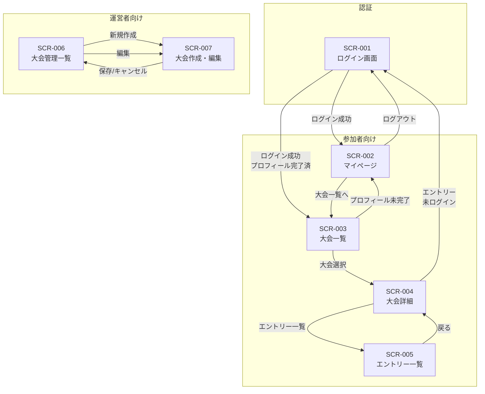

# 画面設計書

## 概要

本ドキュメントは「Jiro-Rimi Cup」Phase 1 の画面設計を定義する。

---

## 1. デザイン概要

### 1.1 デザインコンセプト

- **ターゲット**: 若い女性を含む幅広いユーザー層に受け入れられやすい、親しみやすく明るいデザイン
- **トーン**: カジュアル・フレンドリー・アクティブ
- **印象**: 清潔感があり、ポップで楽しげな雰囲気

### 1.2 レイアウト方式

**サイドメニュー方式**を採用する。

```
┌─────────────────────────────────────────────────────┐
│  ヘッダー（ロゴ・ユーザー情報）                      │
├──────────┬──────────────────────────────────────────┤
│          │                                          │
│  サイド  │                                          │
│  メニュー │         メインコンテンツ                 │
│          │                                          │
│          │                                          │
│          │                                          │
├──────────┴──────────────────────────────────────────┤
│  フッター                                            │
└─────────────────────────────────────────────────────┘
```

**サイドメニュー要素**:
| 項目 | 未ログイン | 参加者 | 運営者 |
|------|:----------:|:------:|:------:|
| 大会一覧 | ○ | ○ | ○ |
| マイページ | - | ○ | ○ |
| 大会管理 | - | - | ○ |
| ログイン | ○ | - | - |
| ログアウト | - | ○ | ○ |

**レスポンシブ対応**:
- モバイル（< 768px）: サイドメニューをハンバーガーメニューに折りたたみ
- タブレット以上: サイドメニュー常時表示

### 1.3 カラーパレット

白とオレンジを基調とした配色。

| 用途 | カラー名 | カラーコード | 使用箇所 |
|------|----------|--------------|----------|
| **プライマリ** | オレンジ | `#FF7A00` | ボタン、アクセント、アクティブ状態 |
| **プライマリ（ホバー）** | ダークオレンジ | `#E66A00` | ボタンホバー時 |
| **プライマリ（淡）** | ライトオレンジ | `#FFF3E6` | 背景ハイライト、選択状態 |
| **ベース** | ホワイト | `#FFFFFF` | メインコンテンツ背景 |
| **背景** | オフホワイト | `#FDF8F4` | ページ背景、サイドメニュー背景 |
| **テキスト（主）** | ダークグレー | `#333333` | 本文テキスト |
| **テキスト（副）** | グレー | `#666666` | サブテキスト、プレースホルダー |
| **ボーダー** | ライトグレー | `#E5E5E5` | 区切り線、カードボーダー |
| **成功** | グリーン | `#22C55E` | 成功メッセージ、完了状態 |
| **エラー** | レッド | `#EF4444` | エラーメッセージ、必須マーク |
| **警告** | イエロー | `#F59E0B` | 警告メッセージ |

### 1.4 タイポグラフィ

| 要素 | フォント | サイズ | ウェイト |
|------|----------|--------|----------|
| 見出し H1 | Noto Sans JP | 24px | Bold (700) |
| 見出し H2 | Noto Sans JP | 20px | Bold (700) |
| 見出し H3 | Noto Sans JP | 16px | SemiBold (600) |
| 本文 | Noto Sans JP | 14px | Regular (400) |
| キャプション | Noto Sans JP | 12px | Regular (400) |
| ボタン | Noto Sans JP | 14px | Medium (500) |

### 1.5 コンポーネントスタイル

**ボタン**:
| 種類 | 背景色 | テキスト色 | 用途 |
|------|--------|------------|------|
| プライマリ | オレンジ | ホワイト | 主要アクション（エントリー、保存） |
| セカンダリ | ホワイト | オレンジ（枠線あり） | 副次アクション（キャンセル） |
| テキスト | 透明 | オレンジ | リンク的なアクション |
| 非活性 | ライトグレー | グレー | 操作不可状態 |

- 角丸: 8px
- パディング: 12px 24px
- ホバー時: 0.9 opacity + 影

**カード**:
- 背景: ホワイト
- 角丸: 12px
- シャドウ: `0 2px 8px rgba(0, 0, 0, 0.08)`
- パディング: 16px - 24px

**入力フォーム**:
- 角丸: 8px
- ボーダー: ライトグレー（フォーカス時: オレンジ）
- パディング: 12px 16px

**バッジ・タグ**:
- 角丸: 16px（pill形状）
- パディング: 4px 12px
- フォントサイズ: 12px

### 1.6 アイコン

- アイコンライブラリ: [Lucide Icons](https://lucide.dev/) または [Heroicons](https://heroicons.com/)
- サイズ: 16px（小）/ 20px（中）/ 24px（大）
- カラー: テキストカラーに準拠

---

## 2. 画面一覧

| No | 画面ID | 画面名 | パス | アクセス権限 | 対応Epic |
|----|--------|--------|------|-------------|----------|
| 1 | SCR-001 | ログイン画面 | `/login` | 全員 | 1.2 |
| 2 | SCR-002 | マイページ（プロフィール設定） | `/mypage` | 認証済みユーザー | 1.3 |
| 3 | SCR-003 | 大会一覧画面（参加者向け） | `/tournaments` | 全員（閲覧）/ 認証済み（エントリー） | 1.5 |
| 4 | SCR-004 | 大会詳細画面 | `/tournaments/[id]` | 全員 | 1.5 |
| 5 | SCR-005 | エントリー一覧画面 | `/tournaments/[id]/events/[eid]/entries` | 全員 | 1.5 |
| 6 | SCR-006 | 大会管理一覧画面（運営者向け） | `/admin/tournaments` | 運営者のみ | 1.4 |
| 7 | SCR-007 | 大会作成・編集画面 | `/admin/tournaments/new`, `/admin/tournaments/[id]/edit` | 運営者のみ | 1.4 |

---

## 3. 各画面の機能一覧

### SCR-001: ログイン画面

**パス**: `/login`

**概要**: Discord アカウントでログインするための画面

| No | 機能ID | 機能名 | 説明 | 対応バックログ |
|----|--------|--------|------|---------------|
| 1 | SCR-001-F01 | Discord ログインボタン | Discord OAuth 認証フローを開始する | 1.2.2 |
| 2 | SCR-001-F02 | ログイン状態リダイレクト | 既にログイン済みの場合、マイページまたは大会一覧にリダイレクト | 1.2.3 |

**画面要素**:
- アプリロゴ
- 「Discordでログイン」ボタン
- 利用規約リンク（任意）

**遷移先**:
- ログイン成功（初回）→ マイページ（プロフィール設定）
- ログイン成功（プロフィール完了済み）→ 大会一覧画面

---

### SCR-002: マイページ（プロフィール設定）

**パス**: `/mypage`

**概要**: ユーザーのプロフィール情報を表示・編集する画面

| No | 機能ID | 機能名 | 説明 | 対応バックログ |
|----|--------|--------|------|---------------|
| 1 | SCR-002-F01 | アバター表示 | Discord アバター画像を表示（編集不可） | 1.3.1 |
| 2 | SCR-002-F02 | プレイヤー名入力 | ゲーム内プレイヤー名を入力・保存 | 1.3.2 |
| 3 | SCR-002-F03 | X ID 入力 | X (Twitter) ID を入力・保存（必須） | 1.3.3 |
| 4 | SCR-002-F04 | 性別選択 | ボーイズ / ガールズ を選択 | 1.3.4 |
| 5 | SCR-002-F05 | ロール優先順位設定 | 5種のロールから3つを選び優先順位を設定 | 1.3.5 |
| 6 | SCR-002-F06 | 初回登録モード | 初回ログイン時は必須項目入力完了まで離脱不可 | 1.3.6 |

**画面モード**:

この画面は2つのモードを持つ。

| モード | 条件 | 特徴 |
|--------|------|------|
| **初回登録モード** | プロフィール未完了 | 必須項目入力を強制、他画面への遷移を制限 |
| **通常モード** | プロフィール完了済み | 自由に編集・遷移可能 |

**初回登録モードの仕様**:

- ウェルカムバナーを表示（「Welcome!」タイトル＋「プロフィールを完成させてください。」メッセージ）
- サブタイトルを「Complete your profile to join tournaments!」に変更
- サイドメニューのナビゲーションリンクを非活性化（My Page以外グレーアウト）
- ログアウトボタンも非活性化
- proxy（ミドルウェア）で `/mypage` と `/auth/callback` と `/api/profile` 以外へのアクセスを `/mypage` にリダイレクト
- 保存ボタンのラベルを「Complete Profile」に変更
- 全必須項目の入力完了・保存後、トップページ（`/`）へフルリロードでリダイレクト

**画面要素**:

**プロフィール情報セクション**:
| 項目 | 型 | 編集 | 必須 | 備考 |
|------|-----|------|------|------|
| アバター画像 | 画像 | 不可 | - | Discord アバターを表示（avatar_url） |
| プレイヤー名 | テキスト入力 | 可 | ○ | ゲーム内表示名 |
| X ID | テキスト入力 | 可 | ○ | @プレフィックス付きで入力 |
| 性別 | ラジオボタン | 可 | ○ | ボーイズ / ガールズ（トグル形式） |
| 第1希望ロール | セレクトボックス | 可 | ○ | 5種から選択 |
| 第2希望ロール | セレクトボックス | 可 | ○ | 5種から選択（第1と重複不可） |
| 第3希望ロール | セレクトボックス | 可 | ○ | 5種から選択（第1,2と重複不可） |

**ロール選択肢**:
- 上キャリー (top_carry)
- 下キャリー (bot_carry)
- 中央 (mid)
- タンク (tank)
- サポート (support)

**バリデーション**:
- X ID: 英数字とアンダースコアのみ、1-15文字
- ロール: 3つすべて選択必須、重複不可

---

### SCR-003: 大会一覧画面（参加者向け）

**パス**: `/tournaments`

**概要**: 参加可能な大会の一覧を表示する画面

| No | 機能ID | 機能名 | 説明 | 対応バックログ |
|----|--------|--------|------|---------------|
| 1 | SCR-003-F01 | 大会一覧表示 | 公開中の大会を一覧表示 | 1.5.1 |
| 2 | SCR-003-F03 | 大会詳細への遷移 | 大会をクリックして詳細画面へ遷移 | 1.5.2 |

**画面要素**:

**大会カード**:
| 項目 | 説明 |
|------|------|
| 大会名 | tournaments.name |
| ステータス | 公開中 / 進行中 等 |

**表示条件**:
- 未ログイン: すべての公開中大会を表示
- ログイン済み: すべての公開中大会を表示

---

### SCR-004: 大会詳細画面

**パス**: `/tournaments/[id]`

**概要**: 大会の詳細情報と予選一覧を表示する画面

| No | 機能ID | 機能名 | 説明 | 対応バックログ |
|----|--------|--------|------|---------------|
| 1 | SCR-004-F01 | 大会情報表示 | 大会名を表示 | 1.5.2 |
| 2 | SCR-004-F02 | イベント一覧表示 | 各イベントの日程・エントリー期限・ステータスを表示 | 1.5.2 |
| 3 | SCR-004-F03 | エントリーボタン | 各イベントにエントリーする | 1.5.3 |
| 4 | SCR-004-F04 | エントリー期限チェック | 期限を過ぎたイベントはボタンを非活性化 | 1.5.4 |
| 5 | SCR-004-F05 | エントリーキャンセルボタン | エントリー済みのイベントをキャンセル | 1.5.4 |
| 6 | SCR-004-F06 | エントリー一覧への遷移 | イベントごとのエントリー一覧画面へ遷移 | 1.5.5 |

**画面要素**:

**大会情報セクション**:
| 項目 | 説明 |
|------|------|
| 大会名 | tournaments.name |

**イベント一覧テーブル**:
| 項目 | 説明 |
|------|------|
| イベント名 | events.name |
| 試合数 | events.matches_per_event |
| 参加上限 | events.max_participants（NULLは無制限） |
| 開催日 | scheduled_date |
| エントリー期間 | entry_start 〜 entry_end |
| チェックイン時間 | checkin_start 〜 checkin_end |
| ステータス | scheduled / entry_open / entry_closed 等 |
| エントリー人数 | 現在のエントリー数（リンク → エントリー一覧） |
| 操作 | エントリー / キャンセル / 期限切れ |

**エントリーボタンの状態**:
| 条件 | ボタン状態 |
|------|----------|
| 招待制イベント | 「招待制」（非活性） |
| 未ログイン | 「ログインしてエントリー」（ログイン画面へ） |
| エントリー期限前 | 「エントリー開始前」（非活性） |
| エントリー期間中 & 未エントリー | 「エントリーする」（活性） |
| エントリー期間中 & エントリー済 | 「キャンセルする」（活性） |
| エントリー期限後 | 「エントリー締切」（非活性） |

---

### SCR-005: エントリー一覧画面

**パス**: `/tournaments/[id]/qualifiers/[qid]/entries`

**概要**: 予選ごとのエントリー者一覧を表示する画面

| No | 機能ID | 機能名 | 説明 | 対応バックログ |
|----|--------|--------|------|---------------|
| 1 | SCR-005-F01 | エントリー者一覧表示 | エントリーしたユーザーの一覧を表示 | 1.5.5 |
| 2 | SCR-005-F02 | 未ログイン閲覧許可 | 認証なしでも閲覧可能 | 1.5.5 |
| 3 | SCR-005-F03 | エントリー人数表示 | 現在のエントリー人数を表示 | 1.5.5 |
| 4 | SCR-005-F04 | ロール分布表示 | 各ロールのエントリー人数を集計・可視化 | 1.5.5 |

**画面要素**:

**サマリーセクション**:
| 項目 | 説明 |
|------|------|
| 大会名 | tournaments.name |
| 予選番号 | event_number |
| 開催日 | scheduled_date |
| エントリー人数 | X名 |

**ロール分布セクション**:
- 円グラフまたは棒グラフで各ロールの分布を表示
- 各ロールの人数とパーセンテージ

| ロール | 表示名 |
|--------|--------|
| top_carry | 上キャリー |
| bot_carry | 下キャリー |
| mid | 中央 |
| tank | タンク |
| support | サポート |

※ 第1希望ロールで集計

**エントリー者テーブル**:
| 項目 | 説明 |
|------|------|
| アバター | profiles.avatar_url（Discord アバター画像） |
| プレイヤー名 | profiles.player_name |
| 第1希望ロール | profiles.first_role |
| 第2希望ロール | profiles.second_role |
| 第3希望ロール | profiles.third_role |
| エントリー日時 | entries.created_at |

---

### SCR-006: 大会管理一覧画面（運営者向け）

**パス**: `/admin/tournaments`

**概要**: 運営者が管理する大会の一覧を表示する画面

| No | 機能ID | 機能名 | 説明 | 対応バックログ |
|----|--------|--------|------|---------------|
| 1 | SCR-006-F01 | 大会一覧表示 | すべての大会を一覧表示（下書き含む） | 1.4.8 |
| 2 | SCR-006-F02 | 大会作成ボタン | 新規大会作成画面へ遷移 | 1.4.2 |
| 3 | SCR-006-F03 | 大会編集への遷移 | 大会編集画面へ遷移 | 1.4.7 |
| 4 | SCR-006-F04 | 運営者権限チェック | 運営者以外はアクセス拒否 | 1.4.1 |

**画面要素**:

**ヘッダー**:
- 「大会管理」タイトル
- 「新規大会作成」ボタン

**大会一覧テーブル**:
| 項目 | 説明 |
|------|------|
| 大会名 | tournaments.name |
| ステータス | draft / open / in_progress / completed |
| イベント数 | 関連する events の数 |
| 作成日 | created_at |
| 操作 | 編集 / 詳細 |

**ステータス表示**:
| ステータス | 表示 | 色 |
|-----------|------|-----|
| draft | 下書き | グレー |
| open | 公開中 | 緑 |
| in_progress | 進行中 | 青 |
| completed | 終了 | グレー |

---

### SCR-007: 大会作成・編集画面

**パス**: `/admin/tournaments/new` (作成), `/admin/tournaments/[id]/edit` (編集)

**概要**: 大会の作成・編集を行う画面

| No | 機能ID | 機能名 | 説明 | 対応バックログ |
|----|--------|--------|------|---------------|
| 1 | SCR-007-F01 | 大会基本情報入力 | 大会名を入力 | 1.4.2 |
| 2 | SCR-007-F02 | イベント追加 | イベントを追加する | 1.4.3 |
| 3 | SCR-007-F03 | イベント削除 | イベントを削除する | 1.4.3 |
| 4 | SCR-007-F04 | イベント名設定 | 各イベントのイベント名を設定 | 1.4.3 |
| 5 | SCR-007-F05 | 試合数設定 | 各イベントの試合数を設定 | 1.4.6 |
| 6 | SCR-007-F06 | 参加上限設定 | 各イベントの参加上限人数を設定（任意） | 1.4.2 |
| 7 | SCR-007-F07 | イベント日程設定 | 各イベントの開催日を設定 | 1.4.3 |
| 8 | SCR-007-F08 | エントリー期限設定 | 各イベントのエントリー開始・締切を設定 | 1.4.4 |
| 9 | SCR-007-F09 | チェックイン時間帯設定 | 各イベントのチェックイン開始・締切を設定 | 1.4.5 |
| 10 | SCR-007-F10 | 大会保存 | 入力内容を保存（作成/更新） | 1.4.2, 1.4.7 |
| 11 | SCR-007-F11 | ステータス変更 | 大会のステータスを変更 | 1.4.7 |

**画面要素**:

**大会基本情報セクション**:
| 項目 | 型 | 必須 | デフォルト | 備考 |
|------|-----|------|-----------|------|
| 大会名 | テキスト入力 | ○ | - | 例: 第1回 Jiro-Rimi Cup |
| ステータス | バッジ表示 | ○ | draft | 編集時のみ表示（読み取り専用）。変更は操作ボタンで行う |

**イベント設定セクション**:

「+ イベントを追加」ボタン

各イベントの入力フォーム:
| 項目 | 型 | 必須 | 備考 |
|------|-----|------|------|
| イベント名 | テキスト入力 | ○ | 例: 予選1 |
| エントリー方式 | セレクトボックス | ○ | オープン / 招待制、デフォルト: オープン |
| 進行形式 | セレクトボックス | ○ | スイスドロー / ダブルエリミネーション / シングルエリミネーション / 総当たり、デフォルト: スイスドロー |
| 試合数 | 数値入力 | ○ | 1-10、デフォルト5 |
| 参加上限 | 数値入力 | - | 未設定で無制限 |
| 開催日 | 日付入力 | ○ | scheduled_date |
| エントリー開始 | 日時入力 | ○ | entry_start |
| エントリー締切 | 日時入力 | ○ | entry_end |
| チェックイン開始 | 日時入力 | ○ | checkin_start |
| チェックイン締切 | 日時入力 | ○ | checkin_end |
| ルール | テキストエリア | - | 任意 |
| 削除 | ボタン | - | イベントを削除 |

**バリデーション**:
- 大会名: 1-100文字
- イベント名: 1-100文字
- 試合数: 1-10の整数
- 時系列制約: `entry_start < entry_end <= checkin_start < checkin_end`
- イベントは最低1つ必要

**操作ボタン**:

ボタンの表示は画面モード・大会ステータスに応じて切り替わる。

| モード | ステータス | 表示ボタン |
|--------|-----------|-----------|
| 作成 | - | キャンセル / 保存 |
| 編集 | draft | キャンセル / 公開 / 保存 |
| 編集 | open, in_progress | キャンセル / 非公開化 / 保存 |
| 編集 | completed | キャンセル / 保存 |

- 「保存」: 大会情報を保存（ステータスは変更しない）
- 「公開」: ステータスを open に変更して保存（draft 時のみ表示）
- 「非公開化」: ステータスを draft に変更して保存（open / in_progress 時のみ表示）
- 「キャンセル」: 変更を破棄して一覧に戻る

※ completed の大会はステータス変更不可（保存ボタンのみ）

---

## 4. 画面遷移図



---

## 5. 共通コンポーネント

### ヘッダー

| 要素 | 未ログイン | ログイン（参加者） | ログイン（運営者） |
|------|----------|------------------|------------------|
| ロゴ | ○ | ○ | ○ |
| 大会一覧リンク | ○ | ○ | ○ |
| マイページリンク | - | ○ | ○ |
| 管理画面リンク | - | - | ○ |
| ログインボタン | ○ | - | - |
| ユーザー名表示 | - | ○ | ○ |
| ログアウトボタン | - | ○ | ○ |

### フッター

- 利用規約リンク
- プライバシーポリシーリンク
- お問い合わせリンク

### 通知・エラー表示

| 種類 | 用途 |
|------|------|
| 成功メッセージ（Toast） | 保存完了、エントリー完了 等 |
| エラーメッセージ（Toast） | バリデーションエラー、サーバーエラー 等 |
| 確認ダイアログ | キャンセル確認、削除確認 等 |
| ローディング表示 | API 通信中 |

---

## 6. レスポンシブ対応

| デバイス | ブレークポイント | 対応方針 |
|----------|----------------|----------|
| モバイル | < 768px | シングルカラム、ハンバーガーメニュー |
| タブレット | 768px - 1024px | 2カラム |
| デスクトップ | > 1024px | フルレイアウト |

---

## 次のステップ

1. 本設計書のレビュー・承認
2. UI/UXデザイン（Figma等でのモックアップ作成）
3. コンポーネント設計
4. 各画面の実装
