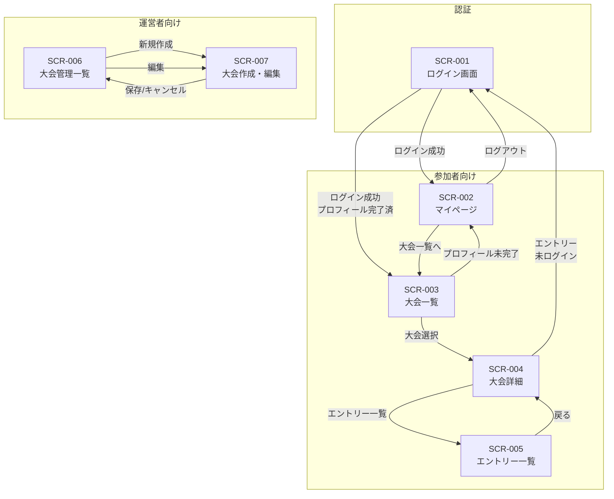

# 画面設計書

## 概要

本ドキュメントは「じろりみ」Phase 1 の画面設計を定義する。

---

## 1. 画面一覧

| No | 画面ID | 画面名 | パス | アクセス権限 | 対応Epic |
|----|--------|--------|------|-------------|----------|
| 1 | SCR-001 | ログイン画面 | `/login` | 全員 | 1.2 |
| 2 | SCR-002 | マイページ（プロフィール設定） | `/mypage` | 認証済みユーザー | 1.3 |
| 3 | SCR-003 | 大会一覧画面（参加者向け） | `/tournaments` | 全員（閲覧）/ 認証済み（エントリー） | 1.5 |
| 4 | SCR-004 | 大会詳細画面 | `/tournaments/[id]` | 全員 | 1.5 |
| 5 | SCR-005 | エントリー一覧画面 | `/tournaments/[id]/qualifiers/[qid]/entries` | 全員 | 1.6 |
| 6 | SCR-006 | 大会管理一覧画面（運営者向け） | `/admin/tournaments` | 運営者のみ | 1.4 |
| 7 | SCR-007 | 大会作成・編集画面 | `/admin/tournaments/new`, `/admin/tournaments/[id]/edit` | 運営者のみ | 1.4 |

---

## 2. 各画面の機能一覧

### SCR-001: ログイン画面

**パス**: `/login`

**概要**: Discord アカウントでログインするための画面

| No | 機能ID | 機能名 | 説明 | 対応バックログ |
|----|--------|--------|------|---------------|
| 1 | SCR-001-F01 | Discord ログインボタン | Discord OAuth 認証フローを開始する | 1.2.2 |
| 2 | SCR-001-F02 | ログイン状態リダイレクト | 既にログイン済みの場合、マイページまたは大会一覧にリダイレクト | 1.2.3 |

**画面要素**:
- アプリロゴ
- 「Discordでログイン」ボタン
- 利用規約リンク（任意）

**遷移先**:
- ログイン成功（初回）→ マイページ（プロフィール設定）
- ログイン成功（プロフィール完了済み）→ 大会一覧画面

---

### SCR-002: マイページ（プロフィール設定）

**パス**: `/mypage`

**概要**: ユーザーのプロフィール情報を表示・編集する画面

| No | 機能ID | 機能名 | 説明 | 対応バックログ |
|----|--------|--------|------|---------------|
| 1 | SCR-002-F01 | Discord ID 表示 | 認証から取得した Discord ID を表示（編集不可） | 1.3.6 |
| 2 | SCR-002-F02 | Discord ユーザー名表示 | Discord のユーザー名を表示（編集不可） | 1.3.6 |
| 3 | SCR-002-F03 | プレイヤー名入力 | ゲーム内プレイヤー名を入力・保存 | 1.3.2 |
| 4 | SCR-002-F04 | X ID 入力 | X (Twitter) ID を入力・保存（必須） | 1.3.3 |
| 5 | SCR-002-F05 | 性別選択 | ボーイズ / ガールズ を選択 | 1.3.4 |
| 6 | SCR-002-F06 | ロール優先順位設定 | 5種のロールから3つを選び優先順位を設定 | 1.3.5 |
| 7 | SCR-002-F07 | プロフィール完了判定 | 必須項目の入力状況を表示 | 1.3.7 |
| 8 | SCR-002-F08 | マイエントリー一覧 | 自分がエントリーした予選の一覧を表示 | 1.5.8 |
| 9 | SCR-002-F09 | ログアウトボタン | セッションを終了してログイン画面へ遷移 | 1.2.4 |

**画面要素**:

**プロフィール情報セクション**:
| 項目 | 型 | 編集 | 必須 | 備考 |
|------|-----|------|------|------|
| Discord ID | テキスト | 不可 | - | 認証から自動取得 |
| Discord ユーザー名 | テキスト | 不可 | - | 認証から自動取得 |
| プレイヤー名 | テキスト入力 | 可 | ○ | ゲーム内表示名 |
| X ID | テキスト入力 | 可 | ○ | @なしで入力 |
| 性別 | ラジオボタン | 可 | ○ | ボーイズ / ガールズ |
| 第1希望ロール | セレクトボックス | 可 | ○ | 5種から選択 |
| 第2希望ロール | セレクトボックス | 可 | ○ | 5種から選択（第1と重複不可） |
| 第3希望ロール | セレクトボックス | 可 | ○ | 5種から選択（第1,2と重複不可） |

**ロール選択肢**:
- 上キャリー (top_carry)
- 下キャリー (bot_carry)
- 中央 (mid)
- タンク (tank)
- サポート (support)

**マイエントリーセクション**:
- エントリー済み予選の一覧（大会名、予選番号、開催日、エントリー日時）
- 各エントリーにキャンセルボタン

**バリデーション**:
- X ID: 英数字とアンダースコアのみ、1-15文字
- ロール: 3つすべて選択必須、重複不可

---

### SCR-003: 大会一覧画面（参加者向け）

**パス**: `/tournaments`

**概要**: 参加可能な大会の一覧を表示する画面

| No | 機能ID | 機能名 | 説明 | 対応バックログ |
|----|--------|--------|------|---------------|
| 1 | SCR-003-F01 | 大会一覧表示 | 公開中の大会を一覧表示 | 1.5.1 |
| 2 | SCR-003-F02 | 性別フィルタリング | ログインユーザーの性別に合った大会のみ表示 | 1.5.1 |
| 3 | SCR-003-F03 | 大会詳細への遷移 | 大会をクリックして詳細画面へ遷移 | 1.5.2 |
| 4 | SCR-003-F04 | プロフィール未完了警告 | プロフィール未完了の場合、警告を表示しマイページへ誘導 | 1.3.7 |

**画面要素**:

**大会カード**:
| 項目 | 説明 |
|------|------|
| 大会名 | tournaments.name |
| 性別区分 | 「じろカップ」/「りみカップ」バッジ |
| ステータス | 公開中 / 進行中 等 |
| 予選回数 | 全予選数 |
| GF進出人数 | gf_advance_count |

**表示条件**:
- 未ログイン: すべての公開中大会を表示
- ログイン済み: ユーザーの性別に合致する大会のみ表示

---

### SCR-004: 大会詳細画面

**パス**: `/tournaments/[id]`

**概要**: 大会の詳細情報と予選一覧を表示する画面

| No | 機能ID | 機能名 | 説明 | 対応バックログ |
|----|--------|--------|------|---------------|
| 1 | SCR-004-F01 | 大会情報表示 | 大会名、性別区分、試合数、GF進出人数を表示 | 1.5.2 |
| 2 | SCR-004-F02 | 予選一覧表示 | 各予選の日程・エントリー期限・ステータスを表示 | 1.5.2 |
| 3 | SCR-004-F03 | エントリーボタン | 各予選にエントリーする | 1.5.3 |
| 4 | SCR-004-F04 | エントリー期限チェック | 期限を過ぎた予選はボタンを非活性化 | 1.5.4 |
| 5 | SCR-004-F05 | プロフィール未完了チェック | 未完了の場合エントリー不可、マイページへ誘導 | 1.5.5 |
| 6 | SCR-004-F06 | 性別チェック | プロフィールの性別と大会の性別区分を照合 | 1.5.6 |
| 7 | SCR-004-F07 | エントリーキャンセルボタン | エントリー済みの予選をキャンセル | 1.5.7 |
| 8 | SCR-004-F08 | エントリー一覧への遷移 | 予選ごとのエントリー一覧画面へ遷移 | 1.6.1 |

**画面要素**:

**大会情報セクション**:
| 項目 | 説明 |
|------|------|
| 大会名 | tournaments.name |
| 性別区分 | boys: じろカップ / girls: りみカップ |
| 1予選あたりの試合数 | matches_per_qualifier |
| GF進出人数 | gf_advance_count |

**予選一覧テーブル**:
| 項目 | 説明 |
|------|------|
| 予選番号 | qualifier_number（例: 予選1） |
| 開催日 | scheduled_date |
| エントリー期間 | entry_start 〜 entry_end |
| チェックイン時間 | checkin_start 〜 checkin_end |
| ステータス | scheduled / entry_open / entry_closed 等 |
| エントリー人数 | 現在のエントリー数（リンク → エントリー一覧） |
| 操作 | エントリー / キャンセル / 期限切れ |

**エントリーボタンの状態**:
| 条件 | ボタン状態 |
|------|----------|
| 未ログイン | 「ログインしてエントリー」（ログイン画面へ） |
| プロフィール未完了 | 「プロフィールを完成させてください」（マイページへ） |
| 性別不一致 | 非表示または「参加資格なし」 |
| エントリー期限前 | 「エントリー開始前」（非活性） |
| エントリー期間中 & 未エントリー | 「エントリーする」（活性） |
| エントリー期間中 & エントリー済 | 「キャンセルする」（活性） |
| エントリー期限後 | 「エントリー締切」（非活性） |

---

### SCR-005: エントリー一覧画面

**パス**: `/tournaments/[id]/qualifiers/[qid]/entries`

**概要**: 予選ごとのエントリー者一覧を表示する画面

| No | 機能ID | 機能名 | 説明 | 対応バックログ |
|----|--------|--------|------|---------------|
| 1 | SCR-005-F01 | エントリー者一覧表示 | エントリーしたユーザーの一覧を表示 | 1.6.1 |
| 2 | SCR-005-F02 | 未ログイン閲覧許可 | 認証なしでも閲覧可能 | 1.6.2 |
| 3 | SCR-005-F03 | エントリー人数表示 | 現在のエントリー人数を表示 | 1.6.3 |
| 4 | SCR-005-F04 | ロール分布表示 | 各ロールのエントリー人数を集計・可視化 | 1.6.4 |

**画面要素**:

**サマリーセクション**:
| 項目 | 説明 |
|------|------|
| 大会名 | tournaments.name |
| 予選番号 | qualifier_number |
| 開催日 | scheduled_date |
| エントリー人数 | X名 |

**ロール分布セクション**:
- 円グラフまたは棒グラフで各ロールの分布を表示
- 各ロールの人数とパーセンテージ

| ロール | 表示名 |
|--------|--------|
| top_carry | 上キャリー |
| bot_carry | 下キャリー |
| mid | 中央 |
| tank | タンク |
| support | サポート |

※ 第1希望ロールで集計

**エントリー者テーブル**:
| 項目 | 説明 |
|------|------|
| プレイヤー名 | profiles.player_name |
| 第1希望ロール | profiles.first_role |
| 第2希望ロール | profiles.second_role |
| 第3希望ロール | profiles.third_role |
| エントリー日時 | entries.created_at |

---

### SCR-006: 大会管理一覧画面（運営者向け）

**パス**: `/admin/tournaments`

**概要**: 運営者が管理する大会の一覧を表示する画面

| No | 機能ID | 機能名 | 説明 | 対応バックログ |
|----|--------|--------|------|---------------|
| 1 | SCR-006-F01 | 大会一覧表示 | すべての大会を一覧表示（下書き含む） | 1.4.8 |
| 2 | SCR-006-F02 | 大会作成ボタン | 新規大会作成画面へ遷移 | 1.4.2 |
| 3 | SCR-006-F03 | 大会編集への遷移 | 大会編集画面へ遷移 | 1.4.7 |
| 4 | SCR-006-F04 | 運営者権限チェック | 運営者以外はアクセス拒否 | 1.4.1 |

**画面要素**:

**ヘッダー**:
- 「大会管理」タイトル
- 「新規大会作成」ボタン

**大会一覧テーブル**:
| 項目 | 説明 |
|------|------|
| 大会名 | tournaments.name |
| 性別区分 | boys / girls |
| ステータス | draft / open / in_progress / completed |
| 予選数 | 関連する qualifiers の数 |
| 作成日 | created_at |
| 操作 | 編集 / 詳細 |

**ステータス表示**:
| ステータス | 表示 | 色 |
|-----------|------|-----|
| draft | 下書き | グレー |
| open | 公開中 | 緑 |
| in_progress | 進行中 | 青 |
| completed | 終了 | グレー |

---

### SCR-007: 大会作成・編集画面

**パス**: `/admin/tournaments/new` (作成), `/admin/tournaments/[id]/edit` (編集)

**概要**: 大会の作成・編集を行う画面

| No | 機能ID | 機能名 | 説明 | 対応バックログ |
|----|--------|--------|------|---------------|
| 1 | SCR-007-F01 | 大会基本情報入力 | 大会名・性別区分を入力 | 1.4.2 |
| 2 | SCR-007-F02 | 試合数設定 | 1予選あたりの試合数を設定 | 1.4.6 |
| 3 | SCR-007-F03 | GF進出人数設定 | GF進出人数を設定 | 1.4.6 |
| 4 | SCR-007-F04 | 参加上限設定 | 参加上限人数を設定（任意） | 1.4.2 |
| 5 | SCR-007-F05 | 予選追加 | 予選を追加する | 1.4.3 |
| 6 | SCR-007-F06 | 予選削除 | 予選を削除する | 1.4.3 |
| 7 | SCR-007-F07 | 予選日程設定 | 各予選の開催日を設定 | 1.4.3 |
| 8 | SCR-007-F08 | エントリー期限設定 | 各予選のエントリー開始・締切を設定 | 1.4.4 |
| 9 | SCR-007-F09 | チェックイン時間帯設定 | 各予選のチェックイン開始・締切を設定 | 1.4.5 |
| 10 | SCR-007-F10 | 大会保存 | 入力内容を保存（作成/更新） | 1.4.2, 1.4.7 |
| 11 | SCR-007-F11 | ステータス変更 | 大会のステータスを変更 | 1.4.7 |

**画面要素**:

**大会基本情報セクション**:
| 項目 | 型 | 必須 | デフォルト | 備考 |
|------|-----|------|-----------|------|
| 大会名 | テキスト入力 | ○ | - | 例: 第1回 じろカップ |
| 性別区分 | ラジオボタン | ○ | - | boys: じろカップ / girls: りみカップ |
| 1予選あたりの試合数 | 数値入力 | ○ | 5 | 1-10 |
| GF進出人数 | 数値入力 | ○ | 20 | 1-100 |
| 参加上限人数 | 数値入力 | - | NULL | 未設定で無制限 |
| ステータス | セレクト | ○ | draft | 編集時のみ変更可能 |

**予選設定セクション**:

「+ 予選を追加」ボタン

各予選の入力フォーム:
| 項目 | 型 | 必須 | 備考 |
|------|-----|------|------|
| 予選番号 | 表示のみ | - | 自動採番（予選1, 予選2, ...） |
| 開催日 | 日付入力 | ○ | scheduled_date |
| エントリー開始 | 日時入力 | ○ | entry_start |
| エントリー締切 | 日時入力 | ○ | entry_end |
| チェックイン開始 | 日時入力 | ○ | checkin_start |
| チェックイン締切 | 日時入力 | ○ | checkin_end |
| 削除 | ボタン | - | 予選を削除 |

**バリデーション**:
- 大会名: 1-100文字
- 時系列制約: `entry_start < entry_end <= checkin_start < checkin_end`
- 予選は最低1つ必要

**操作ボタン**:
- 「保存」: 大会を保存（下書きまたは更新）
- 「公開」: ステータスを open に変更して保存（編集時のみ）
- 「キャンセル」: 変更を破棄して一覧に戻る

---

## 3. 画面遷移図

---

## 4. 共通コンポーネント

### ヘッダー

| 要素 | 未ログイン | ログイン（参加者） | ログイン（運営者） |
|------|----------|------------------|------------------|
| ロゴ | ○ | ○ | ○ |
| 大会一覧リンク | ○ | ○ | ○ |
| マイページリンク | - | ○ | ○ |
| 管理画面リンク | - | - | ○ |
| ログインボタン | ○ | - | - |
| ユーザー名表示 | - | ○ | ○ |
| ログアウトボタン | - | ○ | ○ |

### フッター

- 利用規約リンク
- プライバシーポリシーリンク
- お問い合わせリンク

### 通知・エラー表示

| 種類 | 用途 |
|------|------|
| 成功メッセージ（Toast） | 保存完了、エントリー完了 等 |
| エラーメッセージ（Toast） | バリデーションエラー、サーバーエラー 等 |
| 確認ダイアログ | キャンセル確認、削除確認 等 |
| ローディング表示 | API 通信中 |

---

## 5. レスポンシブ対応

| デバイス | ブレークポイント | 対応方針 |
|----------|----------------|----------|
| モバイル | < 768px | シングルカラム、ハンバーガーメニュー |
| タブレット | 768px - 1024px | 2カラム |
| デスクトップ | > 1024px | フルレイアウト |

---

## 次のステップ

1. 本設計書のレビュー・承認
2. UI/UXデザイン（Figma等でのモックアップ作成）
3. コンポーネント設計
4. 各画面の実装
