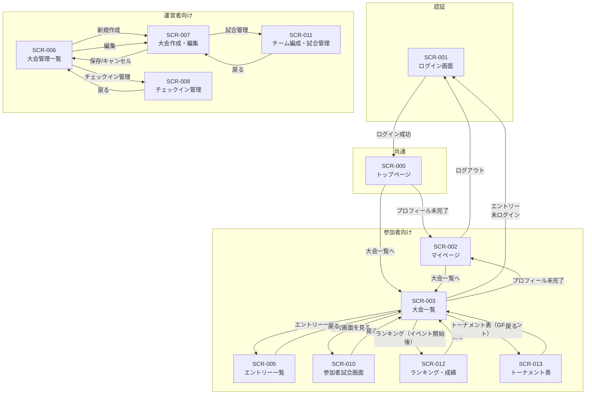

# 画面設計書

## 概要

本ドキュメントは「Jiro-Rimi Cup」の画面設計の全体概要を定義する。
各画面の詳細設計（機能一覧・画面要素・ワイヤーフレーム）は [画面詳細設計書](./screen_design_detail.md) を参照。

---

## 1. デザイン概要

### 1.1 デザインコンセプト

- **ターゲット**: 若い女性を含む幅広いユーザー層に受け入れられやすい、親しみやすく明るいデザイン
- **トーン**: カジュアル・フレンドリー・アクティブ
- **印象**: 清潔感があり、ポップで楽しげな雰囲気

### 1.2 レイアウト方式

**サイドメニュー方式**を採用する。

```
┌──────────┬──────────────────────────────────────────┐
│          │                                          │
│  サイド  │                                          │
│  メニュー │         メインコンテンツ                 │
│（ロゴ・  │                                          │
│ ナビ・   │                                          │
│ ユーザー）│                                          │
│          │                                          │
└──────────┴──────────────────────────────────────────┘
```

**サイドメニュー要素**:
| 項目 | 遷移先 | 未ログイン | 参加者 | 運営者 |
|------|--------|:----------:|:------:|:------:|
| Home | `/` | ○ | ○ | ○ |
| 大会一覧 | `/tournaments` | ○ | ○ | ○ |
| マイページ | `/mypage` | - | ○ | ○ |
| 大会管理 | `/admin/tournaments` | - | - | ○ |
| ログイン | `/login` | ○ | - | - |
| ログアウト | - | - | ○ | ○ |

**レスポンシブ対応**:
- モバイル（< 768px）: サイドメニューをハンバーガーメニューに折りたたみ
- タブレット以上: サイドメニュー常時表示

### 1.3 カラーパレット

白とオレンジを基調とした配色。

| 用途 | カラー名 | カラーコード | 使用箇所 |
|------|----------|--------------|----------|
| **プライマリ** | オレンジ | `#FF7A00` | ボタン、アクセント、アクティブ状態 |
| **プライマリ（ホバー）** | ダークオレンジ | `#E66A00` | ボタンホバー時 |
| **プライマリ（淡）** | ライトオレンジ | `#FFF3E6` | 背景ハイライト、選択状態 |
| **ベース** | ホワイト | `#FFFFFF` | メインコンテンツ背景 |
| **背景** | オフホワイト | `#FDF8F4` | ページ背景、サイドメニュー背景 |
| **テキスト（主）** | ダークグレー | `#333333` | 本文テキスト |
| **テキスト（副）** | グレー | `#666666` | サブテキスト、プレースホルダー |
| **ボーダー** | ライトグレー | `#E5E5E5` | 区切り線、カードボーダー |
| **成功** | グリーン | `#22C55E` | 成功メッセージ、完了状態 |
| **エラー** | レッド | `#EF4444` | エラーメッセージ、必須マーク |
| **警告** | イエロー | `#F59E0B` | 警告メッセージ |

### 1.4 タイポグラフィ

| 要素 | フォント | サイズ | ウェイト |
|------|----------|--------|----------|
| 見出し H1 | Noto Sans JP | 24px | Bold (700) |
| 見出し H2 | Noto Sans JP | 20px | Bold (700) |
| 見出し H3 | Noto Sans JP | 16px | SemiBold (600) |
| 本文 | Noto Sans JP | 14px | Regular (400) |
| キャプション | Noto Sans JP | 12px | Regular (400) |
| ボタン | Noto Sans JP | 14px | Medium (500) |

### 1.5 コンポーネントスタイル

**ボタン**:
| 種類 | 背景色 | テキスト色 | 用途 |
|------|--------|------------|------|
| プライマリ | オレンジ | ホワイト | 主要アクション（エントリー、保存） |
| セカンダリ | ホワイト | オレンジ（枠線あり） | 副次アクション（キャンセル） |
| テキスト | 透明 | オレンジ | リンク的なアクション |
| 非活性 | ライトグレー | グレー | 操作不可状態 |

- 角丸: 8px
- パディング: 12px 24px
- ホバー時: 0.9 opacity + 影

**カード**:
- 背景: ホワイト
- 角丸: 12px
- シャドウ: `0 2px 8px rgba(0, 0, 0, 0.08)`
- パディング: 16px - 24px

**入力フォーム**:
- 角丸: 8px
- ボーダー: ライトグレー（フォーカス時: オレンジ）
- パディング: 12px 16px

**バッジ・タグ**:
- 角丸: 16px（pill形状）
- パディング: 4px 12px
- フォントサイズ: 12px

### 1.6 アイコン

- アイコンライブラリ: [Lucide Icons](https://lucide.dev/) または [Heroicons](https://heroicons.com/)
- サイズ: 16px（小）/ 20px（中）/ 24px（大）
- カラー: テキストカラーに準拠

---

## 2. 画面一覧

| No | 画面ID | 画面名 | パス | アクセス権限 | 対応Epic |
|----|--------|--------|------|-------------|----------|
| 0 | SCR-000 | トップページ | `/` | 全員 | - |
| 1 | SCR-001 | ログイン画面 | `/login` | 全員 | 1.2 |
| 2 | SCR-002 | マイページ（プロフィール設定） | `/mypage` | 認証済みユーザー | 1.3 |
| 3 | SCR-003 | 大会一覧画面（参加者向け） | `/tournaments` | 全員（閲覧）/ 認証済み（エントリー・チェックイン） | 1.5, 2.2 |
| 4 | SCR-005 | エントリー一覧画面 | `/tournaments/[id]/events/[eid]/entries` | 全員 | 1.5, 2.2 |
| 5 | SCR-006 | 大会管理一覧画面（運営者向け） | `/admin/tournaments` | 運営者のみ | 1.4 |
| 6 | SCR-007 | 大会作成・編集画面 | `/admin/tournaments/new`, `/admin/tournaments/[id]/edit` | 運営者のみ | 1.4 |
| 7 | SCR-008 | チェックイン管理画面（運営者向け） | `/admin/tournaments/[id]/events/[eid]/checkin` | 運営者のみ | 2.2 |
| 8 | SCR-009 | （SCR-011に統合） | - | - | - |
| 9 | SCR-010 | 参加者試合画面 | `/tournaments/[id]/events/[eid]/matches` | 認証済みユーザー（マッチ参加者） | 2.4 |
| 10 | SCR-011 | チーム編成・試合進行管理画面（運営者向け） | `/admin/tournaments/[id]/events/[eid]/matches` | 運営者のみ | 2.3, 2.4 |
| 11 | SCR-012 | ランキング・成績画面 | `/tournaments/[id]/events/[eid]/ranking` | 全員 | 2.5 |
| 12 | SCR-013 | トーナメント表画面 | `/tournaments/[id]/events/[eid]/bracket` | 全員 | 3.4.1 |

---

## 3. 画面遷移図


```mermaid
flowchart TD
    subgraph 認証
        LOGIN[SCR-001<br/>ログイン画面]
    end

    subgraph 共通
        TOP[SCR-000<br/>トップページ]
    end

    subgraph 参加者向け
        MYPAGE[SCR-002<br/>マイページ]
        TOURNAMENTS[SCR-003<br/>大会一覧]
        ENTRY_LIST[SCR-005<br/>エントリー一覧]
        MATCH[SCR-010<br/>参加者試合画面]
        RANKING[SCR-012<br/>ランキング・成績]
        BRACKET[SCR-013<br/>トーナメント表]
    end

    subgraph 運営者向け
        ADMIN_TOURNAMENTS[SCR-006<br/>大会管理一覧]
        ADMIN_TOURNAMENT_EDIT[SCR-007<br/>大会作成・編集]
        ADMIN_CHECKIN[SCR-008<br/>チェックイン管理]
        ADMIN_MATCHES[SCR-011<br/>チーム編成・試合管理]
    end

    LOGIN -->|ログイン成功| TOP
    TOP -->|プロフィール未完了| MYPAGE
    TOP -->|大会一覧へ| TOURNAMENTS

    MYPAGE -->|大会一覧へ| TOURNAMENTS
    MYPAGE -->|ログアウト| LOGIN

    TOURNAMENTS -->|エントリー一覧| ENTRY_LIST
    TOURNAMENTS -->|試合画面を見る| MATCH
    TOURNAMENTS -->|エントリー<br/>未ログイン| LOGIN
    TOURNAMENTS -->|プロフィール未完了| MYPAGE

    ENTRY_LIST -->|戻る| TOURNAMENTS
    MATCH -->|戻る| TOURNAMENTS
    TOURNAMENTS -->|ランキング（イベント開始後）| RANKING
    RANKING -->|戻る| TOURNAMENTS
    TOURNAMENTS -->|トーナメント表（GFイベント）| BRACKET
    BRACKET -->|戻る| TOURNAMENTS

    ADMIN_TOURNAMENTS -->|新規作成| ADMIN_TOURNAMENT_EDIT
    ADMIN_TOURNAMENTS -->|編集| ADMIN_TOURNAMENT_EDIT
    ADMIN_TOURNAMENTS -->|チェックイン管理| ADMIN_CHECKIN
    ADMIN_TOURNAMENT_EDIT -->|保存/キャンセル| ADMIN_TOURNAMENTS
    ADMIN_CHECKIN -->|戻る| ADMIN_TOURNAMENTS
    ADMIN_TOURNAMENT_EDIT -->|試合管理| ADMIN_MATCHES
    ADMIN_MATCHES -->|戻る| ADMIN_TOURNAMENT_EDIT
```

---

## 4. 共通コンポーネント

### サイドバー（メインナビゲーション）

共通ナビゲーションはサイドバー中心で構成する。ナビゲーション項目は「1.2 レイアウト方式」のサイドメニュー要素を参照。

| 要素 | 説明 |
|------|------|
| ロゴ | アプリロゴを表示 |
| ナビゲーションリンク | Home・大会一覧・マイページ・大会管理（権限に応じて表示） |
| ログイン/ログアウト | 認証状態に応じて切り替え |
| ユーザー情報 | ログイン時にアバター・ユーザー名を表示 |

> **Note**: ヘッダーコンポーネントは現在未使用。将来的に削除予定（リファクタリング候補）。フッターは現時点では仕様不要のため定義しない。

### 通知・エラー表示

| 種類 | 用途 |
|------|------|
| 成功メッセージ（Toast） | 保存完了、エントリー完了 等 |
| エラーメッセージ（Toast） | バリデーションエラー、サーバーエラー 等 |
| 確認ダイアログ | キャンセル確認、削除確認 等 |
| ローディング表示 | API 通信中 |

---

## 5. レスポンシブ対応

| デバイス | ブレークポイント | 対応方針 |
|----------|----------------|----------|
| モバイル | < 768px | シングルカラム、ハンバーガーメニュー |
| タブレット | 768px - 1024px | 2カラム |
| デスクトップ | > 1024px | フルレイアウト |
