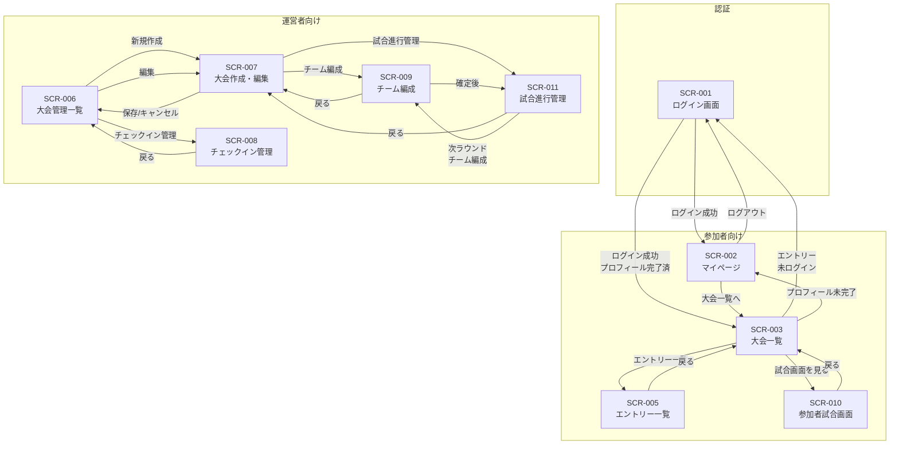

# 画面設計書

## 概要

本ドキュメントは「Jiro-Rimi Cup」の画面設計を定義する。

---

## 1. デザイン概要

### 1.1 デザインコンセプト

- **ターゲット**: 若い女性を含む幅広いユーザー層に受け入れられやすい、親しみやすく明るいデザイン
- **トーン**: カジュアル・フレンドリー・アクティブ
- **印象**: 清潔感があり、ポップで楽しげな雰囲気

### 1.2 レイアウト方式

**サイドメニュー方式**を採用する。

```
┌─────────────────────────────────────────────────────┐
│  ヘッダー（ロゴ・ユーザー情報）                      │
├──────────┬──────────────────────────────────────────┤
│          │                                          │
│  サイド  │                                          │
│  メニュー │         メインコンテンツ                 │
│          │                                          │
│          │                                          │
│          │                                          │
├──────────┴──────────────────────────────────────────┤
│  フッター                                            │
└─────────────────────────────────────────────────────┘
```

**サイドメニュー要素**:
| 項目 | 未ログイン | 参加者 | 運営者 |
|------|:----------:|:------:|:------:|
| 大会一覧 | ○ | ○ | ○ |
| マイページ | - | ○ | ○ |
| 大会管理 | - | - | ○ |
| ログイン | ○ | - | - |
| ログアウト | - | ○ | ○ |

**レスポンシブ対応**:
- モバイル（< 768px）: サイドメニューをハンバーガーメニューに折りたたみ
- タブレット以上: サイドメニュー常時表示

### 1.3 カラーパレット

白とオレンジを基調とした配色。

| 用途 | カラー名 | カラーコード | 使用箇所 |
|------|----------|--------------|----------|
| **プライマリ** | オレンジ | `#FF7A00` | ボタン、アクセント、アクティブ状態 |
| **プライマリ（ホバー）** | ダークオレンジ | `#E66A00` | ボタンホバー時 |
| **プライマリ（淡）** | ライトオレンジ | `#FFF3E6` | 背景ハイライト、選択状態 |
| **ベース** | ホワイト | `#FFFFFF` | メインコンテンツ背景 |
| **背景** | オフホワイト | `#FDF8F4` | ページ背景、サイドメニュー背景 |
| **テキスト（主）** | ダークグレー | `#333333` | 本文テキスト |
| **テキスト（副）** | グレー | `#666666` | サブテキスト、プレースホルダー |
| **ボーダー** | ライトグレー | `#E5E5E5` | 区切り線、カードボーダー |
| **成功** | グリーン | `#22C55E` | 成功メッセージ、完了状態 |
| **エラー** | レッド | `#EF4444` | エラーメッセージ、必須マーク |
| **警告** | イエロー | `#F59E0B` | 警告メッセージ |

### 1.4 タイポグラフィ

| 要素 | フォント | サイズ | ウェイト |
|------|----------|--------|----------|
| 見出し H1 | Noto Sans JP | 24px | Bold (700) |
| 見出し H2 | Noto Sans JP | 20px | Bold (700) |
| 見出し H3 | Noto Sans JP | 16px | SemiBold (600) |
| 本文 | Noto Sans JP | 14px | Regular (400) |
| キャプション | Noto Sans JP | 12px | Regular (400) |
| ボタン | Noto Sans JP | 14px | Medium (500) |

### 1.5 コンポーネントスタイル

**ボタン**:
| 種類 | 背景色 | テキスト色 | 用途 |
|------|--------|------------|------|
| プライマリ | オレンジ | ホワイト | 主要アクション（エントリー、保存） |
| セカンダリ | ホワイト | オレンジ（枠線あり） | 副次アクション（キャンセル） |
| テキスト | 透明 | オレンジ | リンク的なアクション |
| 非活性 | ライトグレー | グレー | 操作不可状態 |

- 角丸: 8px
- パディング: 12px 24px
- ホバー時: 0.9 opacity + 影

**カード**:
- 背景: ホワイト
- 角丸: 12px
- シャドウ: `0 2px 8px rgba(0, 0, 0, 0.08)`
- パディング: 16px - 24px

**入力フォーム**:
- 角丸: 8px
- ボーダー: ライトグレー（フォーカス時: オレンジ）
- パディング: 12px 16px

**バッジ・タグ**:
- 角丸: 16px（pill形状）
- パディング: 4px 12px
- フォントサイズ: 12px

### 1.6 アイコン

- アイコンライブラリ: [Lucide Icons](https://lucide.dev/) または [Heroicons](https://heroicons.com/)
- サイズ: 16px（小）/ 20px（中）/ 24px（大）
- カラー: テキストカラーに準拠

---

## 2. 画面一覧

| No | 画面ID | 画面名 | パス | アクセス権限 | 対応Epic |
|----|--------|--------|------|-------------|----------|
| 1 | SCR-001 | ログイン画面 | `/login` | 全員 | 1.2 |
| 2 | SCR-002 | マイページ（プロフィール設定） | `/mypage` | 認証済みユーザー | 1.3 |
| 3 | SCR-003 | 大会一覧画面（参加者向け） | `/tournaments` | 全員（閲覧）/ 認証済み（エントリー・チェックイン） | 1.5, 2.2 |
| 4 | SCR-005 | エントリー一覧画面 | `/tournaments/[id]/events/[eid]/entries` | 全員 | 1.5, 2.2 |
| 5 | SCR-006 | 大会管理一覧画面（運営者向け） | `/admin/tournaments` | 運営者のみ | 1.4 |
| 6 | SCR-007 | 大会作成・編集画面 | `/admin/tournaments/new`, `/admin/tournaments/[id]/edit` | 運営者のみ | 1.4 |
| 7 | SCR-008 | チェックイン管理画面（運営者向け） | `/admin/tournaments/[id]/events/[eid]/checkin` | 運営者のみ | 2.2 |
| 8 | SCR-009 | チーム編成画面（運営者向け） | `/admin/tournaments/[id]/events/[eid]/team-assignment` | 運営者のみ | 2.3 |
| 9 | SCR-010 | 参加者試合画面 | `/tournaments/[id]/events/[eid]/matches` | 認証済みユーザー（マッチ参加者） | 2.4 |
| 10 | SCR-011 | 試合進行管理画面（運営者向け） | `/admin/tournaments/[id]/events/[eid]/matches` | 運営者のみ | 2.4 |

---

## 3. 各画面の機能一覧

### SCR-001: ログイン画面

**パス**: `/login`

**概要**: Discord アカウントでログインするための画面

| No | 機能ID | 機能名 | 説明 | 対応バックログ |
|----|--------|--------|------|---------------|
| 1 | SCR-001-F01 | Discord ログインボタン | Discord OAuth 認証フローを開始する | 1.2.2 |
| 2 | SCR-001-F02 | ログイン状態リダイレクト | 既にログイン済みの場合、マイページまたは大会一覧にリダイレクト | 1.2.3 |

**画面要素**:
- アプリロゴ
- 「Discordでログイン」ボタン
- 利用規約リンク（任意）

**遷移先**:
- ログイン成功（初回）→ マイページ（プロフィール設定）
- ログイン成功（プロフィール完了済み）→ 大会一覧画面

---

### SCR-002: マイページ（プロフィール設定）

**パス**: `/mypage`

**概要**: ユーザーのプロフィール情報を表示・編集する画面

| No | 機能ID | 機能名 | 説明 | 対応バックログ |
|----|--------|--------|------|---------------|
| 1 | SCR-002-F01 | アバター表示 | Discord アバター画像を表示（編集不可） | 1.3.1 |
| 2 | SCR-002-F02 | プレイヤー名入力 | ゲーム内プレイヤー名を入力・保存 | 1.3.2 |
| 3 | SCR-002-F03 | X ID 入力 | X (Twitter) ID を入力・保存（必須） | 1.3.3 |
| 4 | SCR-002-F04 | 性別選択 | ボーイズ / ガールズ を選択 | 1.3.4 |
| 5 | SCR-002-F05 | ロール優先順位設定 | 5種のロールから3つを選び優先順位を設定 | 1.3.5 |
| 6 | SCR-002-F06 | 初回登録モード | 初回ログイン時は必須項目入力完了まで離脱不可 | 1.3.6 |

**画面モード**:

この画面は2つのモードを持つ。

| モード | 条件 | 特徴 |
|--------|------|------|
| **初回登録モード** | プロフィール未完了 | 必須項目入力を強制、他画面への遷移を制限 |
| **通常モード** | プロフィール完了済み | 自由に編集・遷移可能 |

**初回登録モードの仕様**:

- ウェルカムバナーを表示（「Welcome!」タイトル＋「プロフィールを完成させてください。」メッセージ）
- サブタイトルを「Complete your profile to join tournaments!」に変更
- サイドメニューのナビゲーションリンクを非活性化（My Page以外グレーアウト）
- ログアウトボタンも非活性化
- proxy（ミドルウェア）で `/mypage` と `/auth/callback` と `/api/profile` 以外へのアクセスを `/mypage` にリダイレクト
- 保存ボタンのラベルを「Complete Profile」に変更
- 全必須項目の入力完了・保存後、トップページ（`/`）へフルリロードでリダイレクト

**画面要素**:

**プロフィール情報セクション**:
| 項目 | 型 | 編集 | 必須 | 備考 |
|------|-----|------|------|------|
| アバター画像 | 画像 | 不可 | - | Discord アバターを表示（avatar_url） |
| プレイヤー名 | テキスト入力 | 可 | ○ | ゲーム内表示名 |
| X ID | テキスト入力 | 可 | ○ | @プレフィックス付きで入力 |
| 性別 | ラジオボタン | 可 | ○ | ボーイズ / ガールズ（トグル形式） |
| 第1希望ロール | セレクトボックス | 可 | ○ | 5種から選択 |
| 第2希望ロール | セレクトボックス | 可 | ○ | 5種から選択（第1と重複不可） |
| 第3希望ロール | セレクトボックス | 可 | ○ | 5種から選択（第1,2と重複不可） |

**ロール選択肢**:
- 上キャリー (top_carry)
- 下キャリー (bot_carry)
- 中央 (mid)
- タンク (tank)
- サポート (support)

**バリデーション**:
- X ID: 英数字とアンダースコアのみ、1-15文字
- ロール: 3つすべて選択必須、重複不可

---

### SCR-003: 大会一覧画面（参加者向け）

**パス**: `/tournaments`

**概要**: 参加可能な大会の一覧を表示する画面。各大会のイベント一覧（エントリーボタン含む）を直接表示する。旧大会詳細画面（SCR-004）の機能を統合。

| No | 機能ID | 機能名 | 説明 | 対応バックログ |
|----|--------|--------|------|---------------|
| 1 | SCR-003-F01 | 大会一覧表示 | 公開中の大会を一覧表示 | 1.5.1 |
| 2 | SCR-003-F02 | イベント一覧表示 | 各大会のイベント一覧を展開表示（日程・エントリー期限等） | 1.5.2 |
| 3 | SCR-003-F03 | エントリーボタン | 各イベントにエントリーする | 1.5.3 |
| 4 | SCR-003-F04 | エントリー期限チェック | 期限を過ぎたイベントはボタンを非活性化 | 1.5.4 |
| 5 | SCR-003-F05 | エントリーキャンセルボタン | エントリー済みのイベントをキャンセル | 1.5.4 |
| 6 | SCR-003-F06 | エントリー一覧への遷移 | イベントごとのエントリー一覧画面へ遷移 | 1.5.5 |
| 7 | SCR-003-F07 | チェックインボタン | エントリー済み予選にチェックインする | 2.2.1 |
| 8 | SCR-003-F08 | チェックイン時間帯チェック | チェックイン可能時間帯外ではボタンを非活性化 | 2.2.1 |
| 9 | SCR-003-F09 | 試合画面リンク | イベント進行中かつチェックイン済みの場合、参加者試合画面へのリンクを表示 | 2.4.1 |

**画面要素**:

**大会セクション**（大会ごとにセクションを表示）:
| 項目 | 説明 |
|------|------|
| 大会名 | tournaments.name（セクションヘッダー） |
| ステータス | 公開中 / 進行中 等（StatusBadge） |

**イベントカード**（各大会内にイベントを一覧表示）:
| 項目 | 説明 |
|------|------|
| イベント名 | events.name |
| 試合数 | events.matches_per_event |
| 参加上限 | events.max_participants（NULLは無制限） |
| 開催日 | scheduled_date |
| エントリー期間 | entry_start 〜 entry_end |
| チェックイン時間 | checkin_start 〜 checkin_end |
| エントリー人数 | 現在のエントリー数（リンク → エントリー一覧） |
| 操作 | エントリー / キャンセル / 期限切れ |

**エントリーボタンの状態**:
| 条件 | ボタン状態 |
|------|----------|
| 招待制イベント | 「招待制」（非活性） |
| 未ログイン | 「ログインしてエントリー」（ログイン画面へ） |
| エントリー期限前 | 「エントリー開始前」（非活性） |
| 性別不一致 | 「参加対象外」（非活性） |
| エントリー期間中 & 未エントリー | 「エントリーする」（活性） |
| エントリー期間中 & エントリー済 | 「キャンセルする」（活性） |
| エントリー期限後 | 「エントリー締切」（非活性） |

**チェックインボタンの状態**:
| 条件 | ボタン状態 |
|------|----------|
| 未エントリー | 表示なし |
| エントリー済 & チェックイン時間帯前 | 「チェックイン開始前」（非活性） |
| エントリー済 & チェックイン時間帯中 & 未チェックイン | 「チェックインする」（活性・プライマリ） |
| エントリー済 & チェックイン済み | 「チェックイン済み ✓」（非活性・成功色） |
| エントリー済 & チェックイン時間帯後 & 未チェックイン | 「チェックイン締切」（非活性） |

**試合画面リンクの状態**:
| 条件 | 表示 |
|------|------|
| イベントが in_progress 以外 | 表示なし |
| イベントが in_progress & 未チェックイン | 表示なし |
| イベントが in_progress & チェックイン済み | 「試合画面を見る」リンク（活性） |

**性別制限バッジ**:
| イベントの gender | バッジ表示 | スタイル |
|------------------|----------|----------|
| `boys` | Boys | 青（`bg-blue-100 text-blue-700`） |
| `girls` | Girls | ピンク（`bg-pink-100 text-pink-700`） |
| `null` | 表示なし | - |

**表示条件**:
- 未ログイン: すべての公開中大会を表示（エントリーボタンはログイン誘導）
- ログイン済み: すべての公開中大会を表示（エントリー・キャンセル操作可能）

---

### SCR-005: エントリー一覧画面

**パス**: `/tournaments/[id]/events/[eid]/entries`

**概要**: 予選ごとのエントリー者一覧を表示する画面

| No | 機能ID | 機能名 | 説明 | 対応バックログ |
|----|--------|--------|------|---------------|
| 1 | SCR-005-F01 | エントリー者一覧表示 | エントリーしたユーザーの一覧を表示 | 1.5.5 |
| 2 | SCR-005-F02 | 未ログイン閲覧許可 | 認証なしでも閲覧可能 | 1.5.5 |
| 3 | SCR-005-F03 | エントリー人数表示 | 現在のエントリー人数を表示 | 1.5.5 |
| 4 | SCR-005-F04 | ロール分布表示 | 各ロールのエントリー人数を集計・可視化 | 1.5.5 |
| 5 | SCR-005-F05 | チェックイン状況表示 | 各エントリー者のチェックイン済み/未済を表示 | 2.2.3 |
| 6 | SCR-005-F06 | チェックイン人数表示 | チェックイン済み人数を表示（例: 15/20人） | 2.2.3 |

**画面要素**:

**サマリーセクション**:
| 項目 | 説明 |
|------|------|
| 大会名 | tournaments.name |
| 予選番号 | event_number |
| 開催日 | scheduled_date |
| エントリー人数 | X名 |
| チェックイン人数 | X/Y名（チェックイン済み/エントリー総数） |

**ロール分布セクション**:
- 円グラフまたは棒グラフで各ロールの分布を表示
- 各ロールの人数とパーセンテージ

| ロール | 表示名 |
|--------|--------|
| top_carry | 上キャリー |
| bot_carry | 下キャリー |
| mid | 中央 |
| tank | タンク |
| support | サポート |

※ 第1希望ロールで集計

**エントリー者テーブル**:
| 項目 | 説明 |
|------|------|
| チェックイン状態 | ✓ アイコン（チェックイン済みの場合） |
| アバター | profiles.avatar_url（Discord アバター画像） |
| プレイヤー名 | profiles.player_name |
| 第1希望ロール | profiles.first_role |
| 第2希望ロール | profiles.second_role |
| 第3希望ロール | profiles.third_role |
| エントリー日時 | entries.created_at |

---

### SCR-006: 大会管理一覧画面（運営者向け）

**パス**: `/admin/tournaments`

**概要**: 運営者が管理する大会の一覧を表示する画面

| No | 機能ID | 機能名 | 説明 | 対応バックログ |
|----|--------|--------|------|---------------|
| 1 | SCR-006-F01 | 大会一覧表示 | すべての大会を一覧表示（下書き含む） | 1.4.8 |
| 2 | SCR-006-F02 | 大会作成ボタン | 新規大会作成画面へ遷移 | 1.4.2 |
| 3 | SCR-006-F03 | 大会編集への遷移 | 大会編集画面へ遷移 | 1.4.7 |
| 4 | SCR-006-F04 | 運営者権限チェック | 運営者以外はアクセス拒否 | 1.4.1 |

**画面要素**:

**ヘッダー**:
- 「大会管理」タイトル
- 「新規大会作成」ボタン

**大会一覧テーブル**:
| 項目 | 説明 |
|------|------|
| 大会名 | tournaments.name |
| ステータス | draft / open / in_progress / completed |
| イベント数 | 関連する events の数 |
| 作成日 | created_at |
| 操作 | 編集 / 詳細 |

**ステータス表示**:
| ステータス | 表示 | 色 |
|-----------|------|-----|
| draft | 下書き | グレー |
| open | 公開中 | 緑 |
| in_progress | 進行中 | 青 |
| completed | 終了 | グレー |

---

### SCR-007: 大会作成・編集画面

**パス**: `/admin/tournaments/new` (作成), `/admin/tournaments/[id]/edit` (編集)

**概要**: 大会の作成・編集を行う画面

| No | 機能ID | 機能名 | 説明 | 対応バックログ |
|----|--------|--------|------|---------------|
| 1 | SCR-007-F01 | 大会基本情報入力 | 大会名を入力 | 1.4.2 |
| 2 | SCR-007-F02 | イベント追加 | イベントを追加する | 1.4.3 |
| 3 | SCR-007-F03 | イベント削除 | イベントを削除する | 1.4.3 |
| 4 | SCR-007-F04 | イベント名設定 | 各イベントのイベント名を設定 | 1.4.3 |
| 5 | SCR-007-F05 | 試合数設定 | 各イベントの試合数を設定 | 1.4.6 |
| 6 | SCR-007-F06 | 参加上限設定 | 各イベントの参加上限人数を設定（任意） | 1.4.2 |
| 7 | SCR-007-F07 | イベント日程設定 | 各イベントの開催日を設定 | 1.4.3 |
| 8 | SCR-007-F08 | エントリー期限設定 | 各イベントのエントリー開始・締切を設定 | 1.4.4 |
| 9 | SCR-007-F09 | チェックイン時間帯設定 | 各イベントのチェックイン開始・締切を設定 | 1.4.5 |
| 10 | SCR-007-F10 | 大会保存 | 入力内容を保存（作成/更新） | 1.4.2, 1.4.7 |
| 11 | SCR-007-F11 | ステータス変更 | 大会のステータスを変更 | 1.4.7 |
| 12 | SCR-007-F12 | イベントステータス表示 | 各イベントのステータス（scheduled/in_progress/completed）をバッジで表示（編集時のみ） | 2.2.4 |
| 13 | SCR-007-F13 | イベント開始 | イベントを開始する。参加者選定モーダルを表示し、除外者を選択して開始（scheduled時のみ） | 2.2.4 |

**画面要素**:

**大会基本情報セクション**:
| 項目 | 型 | 必須 | デフォルト | 備考 |
|------|-----|------|-----------|------|
| 大会名 | テキスト入力 | ○ | - | 例: 第1回 Jiro-Rimi Cup |
| ステータス | バッジ表示 | ○ | draft | 編集時のみ表示（読み取り専用）。変更は操作ボタンで行う |

**イベント設定セクション**:

「+ イベントを追加」ボタン

各イベントの入力フォーム:
| 項目 | 型 | 必須 | 備考 |
|------|-----|------|------|
| イベント名 | テキスト入力 | ○ | 例: 予選1 |
| エントリー方式 | セレクトボックス | ○ | オープン / 招待制、デフォルト: オープン |
| 進行形式 | セレクトボックス | ○ | 予選 / ダブルエリミネーション、デフォルト: 予選 |
| 試合数 | 数値入力 | △ | 1-10、デフォルト5。予選の場合のみ入力可、ダブルエリミネーションの場合は非活性 |
| 参加上限 | 数値入力 | - | 未設定で無制限 |
| 開催日 | 日付入力 | ○ | scheduled_date |
| エントリー開始 | 日時入力 | ○ | entry_start |
| エントリー締切 | 日時入力 | ○ | entry_end |
| チェックイン開始 | 日時入力 | ○ | checkin_start |
| チェックイン締切 | 日時入力 | ○ | checkin_end |
| 性別区分 | セレクトボックス | - | 制限なし / Boy / Girl。設定すると該当の性別のみエントリー可能 |
| ルール | テキストエリア | - | 任意 |
| 削除 | ボタン | - | イベントを削除 |
| チェックイン管理リンク | アイコンボタン | - | 編集時のみ表示。チェックイン管理画面へ遷移 |
| チーム編成リンク | アイコンボタン | - | 編集時・in_progress時のみ表示。チーム編成画面へ遷移 |
| 試合進行管理リンク | アイコンボタン | - | 編集時・in_progress時のみ表示。試合進行管理画面へ遷移 |
| イベント開始ボタン | ボタン | - | 編集時・scheduled時のみ表示。押下で参加者選定モーダルを表示 |
| ステータスバッジ | バッジ | - | 編集時・in_progress/completed時に表示（「進行中」/「終了」） |

**バリデーション**:
- 大会名: 1-100文字
- イベント名: 1-100文字
- 試合数: 予選の場合は必須（1-10の整数）、ダブルエリミネーションの場合は入力不可
- 時系列制約: `entry_start < entry_end <= checkin_start < checkin_end`
- イベントは最低1つ必要

**操作ボタン**:

ボタンの表示は画面モード・大会ステータスに応じて切り替わる。

| モード | ステータス | 表示ボタン |
|--------|-----------|-----------|
| 作成 | - | キャンセル / 保存 |
| 編集 | draft | キャンセル / 公開 / 保存 |
| 編集 | open, in_progress | キャンセル / 非公開化 / 保存 |
| 編集 | completed | キャンセル / 保存 |

- 「保存」: 大会情報を保存（ステータスは変更しない）
- 「公開」: ステータスを open に変更して保存（draft 時のみ表示）
- 「非公開化」: ステータスを draft に変更して保存（open / in_progress 時のみ表示）
- 「キャンセル」: 変更を破棄して一覧に戻る

※ completed の大会はステータス変更不可（保存ボタンのみ）

**参加者選定モーダル（イベント開始時）**:

イベント開始ボタン押下で表示。チェックイン済みエントリーをクライアント側で取得して表示する。

| 項目 | 説明 |
|------|------|
| サマリー | 「チェックイン: X人 → 参加: Y人（Z人除外）」参加人数が10の倍数でないか10未満の場合は赤色警告 |
| 参加者リスト | チェックイン済みエントリー一覧（チェックイン時刻降順＝遅い順から表示）。チェックボックスで参加/除外をトグル |
| 自動除外 | デフォルトでチェックインが遅い順（リスト上部）からチェックイン済み人数 % 10 人を除外 |
| 開始ボタン | 参加人数が10の倍数かつ10人以上のとき有効。除外者の checked_in_at を null に戻しイベントを開始 |

---

### SCR-008: チェックイン管理画面（運営者向け）

**パス**: `/admin/tournaments/[id]/events/[eid]/checkin`

**概要**: 運営者がイベントのチェックイン状況を管理する画面

| No | 機能ID | 機能名 | 説明 | 対応バックログ |
|----|--------|--------|------|---------------|
| 1 | SCR-008-F01 | エントリー者一覧表示 | イベントのエントリー者一覧とチェックイン状況を表示 | 2.2.2 |
| 2 | SCR-008-F02 | チェックイン追加 | 運営者が任意の参加者をチェックイン済みにする | 2.2.2 |
| 3 | SCR-008-F03 | チェックイン削除 | 運営者が任意の参加者のチェックインを取り消す | 2.2.2 |
| 4 | SCR-008-F04 | 一括チェックイン | 複数の参加者を一括でチェックイン済みにする | 2.2.2 |
| 5 | SCR-008-F05 | チェックイン人数サマリー | チェックイン済み/未済の人数を表示 | 2.2.2 |
| 6 | SCR-008-F06 | 運営者権限チェック | 運営者以外はアクセス拒否 | 2.2.2 |
| 7 | SCR-008-F07 | イベントステータス表示 | イベントのステータスに応じたバッジを表示（in_progress/completed） | 2.2.4 |
| 8 | SCR-008-F08 | 開始後操作無効化 | イベント開始後はチェックイン追加・取り消しボタンを非表示 | 2.2.4 |

**画面要素**:

**ヘッダー**:
- 「チェックイン管理」タイトル
- イベント名・開催日の表示
- 大会管理画面への戻るリンク

**イベントステータスセクション**:
| イベントステータス | 表示 |
|-------------------|------|
| scheduled | 表示なし |
| in_progress | 「イベント進行中」バッジ |
| completed | 「終了」バッジ |

※ イベント開始操作は大会編集画面（SCR-007）から行う

**サマリーセクション**:
| 項目 | 説明 |
|------|------|
| チェックイン人数 | X/Y名（チェックイン済み/エントリー総数） |
| チェックイン時間帯 | checkin_start 〜 checkin_end |
| 現在のステータス | 「チェックイン受付中」/「チェックイン開始前」/「チェックイン締切」 |

**参加者一覧テーブル**:
| 項目 | 説明 |
|------|------|
| チェックボックス | 一括操作用の選択 |
| チェックイン状態 | ✓ アイコン or 「-」 |
| アバター | profiles.avatar_url |
| プレイヤー名 | profiles.player_name |
| 第1希望ロール | profiles.first_role |
| チェックイン日時 | entries.checked_in_at（チェックイン済みの場合） |
| 操作 | 「チェックイン」/「取り消し」ボタン |

**操作ボタン**:
| ボタン | 説明 |
|--------|------|
| 選択者をチェックイン | 選択した参加者を一括でチェックイン済みにする |
| 選択者のチェックインを取り消し | 選択した参加者のチェックインを一括で取り消す |

**備考**:
- 運営者はチェックイン時間帯に関係なく操作可能
- チェックイン追加時は現在時刻が checked_in_at に設定される
- チェックイン取り消し時は checked_in_at が null に設定される
- イベント開始後（in_progress / completed）はチェックイン追加・取り消しボタンが非表示になる

---

### SCR-009: チーム編成画面（運営者向け）

**パス**: `/admin/tournaments/[id]/events/[eid]/team-assignment`

**概要**: 運営者がチェックイン済み参加者を5v5マッチに手動編成し、確定する画面

**前提条件**: イベントのステータスが `in_progress` であること

| No | 機能ID | 機能名 | 説明 | 対応バックログ |
|----|--------|--------|------|---------------|
| 1 | SCR-009-F01 | 未配置参加者一覧表示 | チェックイン済み参加者をプレイヤー名・ロール希望と共に表示 | 2.3.1 |
| 2 | SCR-009-F02 | マッチ枠自動生成 | チェックイン済み参加者数 ÷ 10 のマッチ枠を自動生成して表示 | 2.3.1 |
| 3 | SCR-009-F03 | 参加者配置操作 | ドラッグ&ドロップ等で参加者をマッチ枠の Team A / Team B に配置 | 2.3.1 |
| 4 | SCR-009-F04 | チーム編成確定 | 全参加者が配置済みの場合のみ確定可能。確認モーダルを経て DB に保存 | 2.3.1 |
| 5 | SCR-009-F05 | 運営者権限チェック | 運営者以外はアクセス拒否 | 2.3.1 |

**画面要素**:

**ヘッダー**:
- 「チーム編成」タイトル
- イベント名・開催日の表示
- 大会編集画面への戻るリンク

**未配置エリア**:

配置先が未決定の参加者を一覧表示する。

| 項目 | 説明 |
|------|------|
| アバター | profiles.avatar_url |
| プレイヤー名 | profiles.player_name |
| 第1希望ロール | profiles.first_role（バッジ表示） |
| 第2希望ロール | profiles.second_role（バッジ表示） |
| 第3希望ロール | profiles.third_role（バッジ表示） |

**マッチ枠エリア**:

参加者数 ÷ 10 のマッチ枠を縦に並べて表示する。各マッチは Team A（5枠）と Team B（5枠）で構成される。

```
Match 1
┌─────────────────────┬─────────────────────┐
│ Team A              │ Team B              │
│ ┌─────────────────┐ │ ┌─────────────────┐ │
│ │ 参加者カード     │ │ │ 参加者カード     │ │
│ │ 参加者カード     │ │ │ 参加者カード     │ │
│ │ 参加者カード     │ │ │ 参加者カード     │ │
│ │ 参加者カード     │ │ │ 参加者カード     │ │
│ │ 参加者カード     │ │ │ 参加者カード     │ │
│ └─────────────────┘ │ └─────────────────┘ │
└─────────────────────┴─────────────────────┘

Match 2
┌─────────────────────┬─────────────────────┐
│ ...                                       │
└───────────────────────────────────────────┘
```

各参加者カードの表示内容:
| 項目 | 説明 |
|------|------|
| アバター | profiles.avatar_url |
| プレイヤー名 | profiles.player_name |
| 第1希望ロール | profiles.first_role（バッジ表示） |

**配置操作**:
- 未配置エリアからマッチ枠へドラッグ&ドロップで配置
- マッチ枠間でもドラッグ&ドロップで移動可能
- マッチ枠から未配置エリアへ戻すことも可能
- 各チーム枠は最大5人。満員の枠にはドロップ不可

**フッター（操作ボタン）**:
| ボタン | 条件 | 説明 |
|--------|------|------|
| 確定 | 全参加者がマッチ枠に配置済み | 確認モーダルを表示 |
| 確定（非活性） | 未配置の参加者が残っている | グレーアウト。「未配置: X人」をツールチップ等で表示 |

**確認モーダル（チーム編成確定時）**:

確定ボタン押下で表示。編成内容のサマリーを確認する。

| 項目 | 説明 |
|------|------|
| サマリー | 「X人をYマッチに編成します」 |
| マッチ一覧 | 各マッチの Team A / Team B のプレイヤー名リスト |
| 確定ボタン | matches（status: waiting）と match_participants を作成 |
| キャンセルボタン | モーダルを閉じて編成画面に戻る |
| 確定後の遷移 | 確定成功後、試合進行管理画面（SCR-011）への遷移リンクを表示 |

**備考**:
- イベントが `in_progress` 以外の場合はアクセス不可（リダイレクト）
- チェックイン済み参加者（`entries.checked_in_at IS NOT NULL`）のみが編成対象
- 確定後は編成内容の変更不可（再編成が必要な場合は既存マッチを削除して再作成）

---

### SCR-010: 参加者試合画面

**パス**: `/tournaments/[id]/events/[eid]/matches`

**概要**: 参加者が自分のマッチの対戦情報確認・ロビー番号入力・勝敗投票を行う画面

**前提条件**: ユーザーがログイン済みで、該当イベントのマッチに参加していること

| No | 機能ID | 機能名 | 説明 | 対応バックログ |
|----|--------|--------|------|---------------|
| 1 | SCR-010-F01 | マッチ情報表示 | 自チーム・相手チームのメンバー一覧を表示（プレイヤー名・ロール） | 2.4.1 |
| 2 | SCR-010-F02 | ロビー番号表示・入力 | マッチのロビー番号を表示し、入力・更新できる（後勝ち方式） | 2.4.1 |
| 3 | SCR-010-F03 | 勝敗投票 | 勝ち/負けを投票できる（マッチが in_progress の場合のみ） | 2.4.1 |
| 4 | SCR-010-F04 | 確定結果表示 | マッチが confirmed の場合に確定結果を表示 | 2.4.1 |
| 5 | SCR-010-F05 | ラウンド切り替え | 複数ラウンドのマッチを切り替えて表示 | 2.4.1 |
| 6 | SCR-010-F06 | 認証・参加チェック | 未ログインまたはマッチ未参加の場合はアクセス拒否 | 2.4.1 |

**画面要素**:

**ヘッダー**:
- イベント名・開催日の表示
- 大会一覧画面への戻るリンク

**ラウンドセレクター**:
- ラウンドタブ（ラウンド1、ラウンド2、...）
- 最新の進行中ラウンドをデフォルト選択
- confirmed ラウンドには完了アイコンを表示

**マッチ情報セクション**:

```
Match - ラウンド X
┌───────────────────┬───────────────────┐
│ ★ Team A          │ Team B            │
│ ┌───────────────┐ │ ┌───────────────┐ │
│ │ P1 [ロール]   │ │ │ P6 [ロール]   │ │
│ │ P2 [ロール]   │ │ │ P7 [ロール]   │ │
│ │ P3 [ロール]   │ │ │ P8 [ロール]   │ │
│ │ P4 [ロール]   │ │ │ P9 [ロール]   │ │
│ │ P5 [ロール]   │ │ │ P10[ロール]   │ │
│ └───────────────┘ │ └───────────────┘ │
└───────────────────┴───────────────────┘

ロビー番号: [________] [更新]

勝敗投票:  [勝ち]  [負け]   あなたの投票: 勝ち

確定結果: Team A の勝利
```

※ ★ は自分が所属するチームを示す（背景色で強調）

各メンバーの表示内容:
| 項目 | 説明 |
|------|------|
| アバター | profiles.avatar_url |
| プレイヤー名 | profiles.player_name |
| 第1希望ロール | profiles.first_role（バッジ表示） |

**ロビー番号セクション**:
| 項目 | 説明 |
|------|------|
| ロビー番号表示 | 現在のロビー番号（未設定の場合は「未設定」） |
| ロビー番号入力 | テキスト入力 + 更新ボタン（マッチが in_progress の場合のみ） |

**勝敗投票セクション**:
| マッチステータス | 表示 |
|----------------|------|
| in_progress & 未投票 | 「勝ち」「負け」ボタン（活性） |
| in_progress & 投票済み | 投票内容を表示 +「変更する」リンク |
| confirmed | 確定結果を表示（「Team A の勝利」等）。投票ボタンは非表示 |

**備考**:
- 参加者はマッチが in_progress の場合のみロビー番号・勝敗を入力可能
- 投票は何度でも変更可能（マッチが in_progress の間）
- マッチが waiting の場合は RLS により非表示（参加者には見えない）
- confirmed の場合はロビー番号入力・勝敗投票を非活性化し、確定結果を表示

---

### SCR-011: 試合進行管理画面（運営者向け）

**パス**: `/admin/tournaments/[id]/events/[eid]/matches`

**概要**: 運営者がラウンド単位で試合を開始・進行状況を確認・結果を確定する画面

**前提条件**: イベントのステータスが `in_progress` であること

| No | 機能ID | 機能名 | 説明 | 対応バックログ |
|----|--------|--------|------|---------------|
| 1 | SCR-011-F01 | ラウンド進行状況表示 | 現在のラウンド番号 / 全ラウンド数を表示 | 2.4.2 |
| 2 | SCR-011-F02 | マッチ一覧表示 | 選択ラウンドの全マッチをチーム構成・ステータスと共に表示 | 2.4.2 |
| 3 | SCR-011-F03 | 試合開始 | 同一ラウンドの全マッチを一斉に開始（waiting → in_progress） | 2.4.2 |
| 4 | SCR-011-F04 | 勝敗入力状況表示 | 各参加者の投票状況（入力済み/未入力）を表示 | 2.4.2 |
| 5 | SCR-011-F05 | 仮結果算出・表示 | 多数決による仮結果を自動算出して表示 | 2.4.2 |
| 6 | SCR-011-F06 | 不一致マッチハイライト | 投票が同数等で仮結果が算出できないマッチをハイライト | 2.4.2 |
| 7 | SCR-011-F07 | 運営者勝敗入力・変更 | 各マッチの結果を運営者が直接入力・変更 | 2.4.2 |
| 8 | SCR-011-F08 | 結果確定 | 全マッチの結果を一括確定（in_progress → confirmed） | 2.4.2 |
| 9 | SCR-011-F09 | 累計成績表示 | 各参加者の現在の勝敗数を表示 | 2.4.2 |
| 10 | SCR-011-F10 | イベント完了 | 全ラウンド消化後にイベントを completed に変更 | 2.4.2 |
| 11 | SCR-011-F11 | 運営者権限チェック | 運営者以外はアクセス拒否 | 2.4.2 |

**画面要素**:

**ヘッダー**:
- 「試合進行管理」タイトル
- イベント名・開催日の表示
- ラウンド進行状況（「ラウンド 2 / 5」）
- 大会編集画面への戻るリンク

**ラウンドセレクター**:
- ラウンドタブ（ラウンド1、ラウンド2、...）
- 各タブにステータスアイコン（waiting / in_progress / confirmed）
- 最新ラウンドをデフォルト選択

**操作ボタンエリア**:
| ボタン | 条件 | 説明 |
|--------|------|------|
| 試合開始 | ラウンド内全マッチが waiting | 全マッチを in_progress に一括変更 |
| 結果確定 | ラウンド内全マッチが in_progress & 全マッチに確定結果が設定済み | 全マッチを confirmed に一括変更 |
| チーム編成（次ラウンド） | 現ラウンドが confirmed & 次ラウンドが未作成 | チーム編成画面（SCR-009）へ遷移 |
| イベント完了 | 全ラウンドが confirmed | 確認後、イベントを completed に変更 |

**マッチ一覧**:

各マッチをカード形式で表示。

```
Match 1                    仮結果: Team A   確定結果: [Team A ▼]
┌─────────────────────┬─────────────────────┐
│ Team A              │ Team B              │
│ P1  [勝ち] ✓入力済 │ P6  [負け] ✓入力済 │
│ P2  [勝ち] ✓入力済 │ P7  [負け] ✓入力済 │
│ P3  [勝ち] ✓入力済 │ P8         ―未入力 │
│ P4  [勝ち] ✓入力済 │ P9  [負け] ✓入力済 │
│ P5         ―未入力 │ P10 [負け] ✓入力済 │
└─────────────────────┴─────────────────────┘
ロビー: 1234    入力状況: 8/10

Match 2                    ⚠ 不一致 (3:2)   確定結果: [― ▼]
┌─────────────────────┬─────────────────────┐
│ ...                                       │
└───────────────────────────────────────────┘
```

各マッチカードの表示内容:
| 項目 | 説明 |
|------|------|
| マッチ番号 | Match 1, Match 2, ... |
| Team A / Team B メンバー | プレイヤー名・投票内容（勝ち/負け）・入力状態（✓/―） |
| ロビー番号 | matches.lobby_number |
| 入力状況 | 投票済み人数 / 全参加者数 |
| 仮結果 | 多数決による算出結果（Team A / Team B / ⚠ 不一致） |
| 確定結果入力 | セレクトボックス（Team A / Team B）。運営者が直接指定 |

**マッチカードの状態（ラウンドステータス別）**:
| ラウンドステータス | 表示内容 |
|------------------|---------|
| waiting | チーム構成のみ表示。投票状況・仮結果・確定結果は非表示 |
| in_progress | チーム構成 + 投票状況 + 仮結果 + 確定結果入力を表示 |
| confirmed | チーム構成 + 確定結果を表示。確定結果入力は非活性 |

**仮結果の算出ロジック**:
| 条件 | 表示 |
|------|------|
| Team A の win 投票 > Team B の win 投票 | 「Team A」（通常表示） |
| Team B の win 投票 > Team A の win 投票 | 「Team B」（通常表示） |
| 同数（1件以上の投票あり） | 「⚠ 不一致」（警告色でハイライト） |
| 全員未投票 | 「―」 |

**不一致マッチのハイライト**:
- マッチカード全体を警告色（イエロー）のボーダーで囲む
- 「⚠ 不一致」バッジを表示

**確定結果入力**:
- セレクトボックスで Team A / Team B を選択
- 仮結果が算出済みの場合はデフォルト値として設定
- 不一致の場合は未選択状態
- 全マッチに確定結果が設定されている場合のみ「結果確定」ボタンが有効化

**累計成績セクション**:

全参加者の現在の成績を表形式で表示。

| 項目 | 説明 |
|------|------|
| プレイヤー名 | profiles.player_name |
| 勝数 | confirmed マッチで所属チームが勝利した回数 |
| 敗数 | confirmed マッチで所属チームが敗北した回数 |
| 勝率 | 勝数 / (勝数 + 敗数) |

**備考**:
- イベントが in_progress 以外の場合はアクセス不可（リダイレクト）
- waiting ステータスのマッチは投票状況を表示しない（チーム構成のみ表示）
- 結果確定後は当該ラウンドの確定結果入力セレクトボックスを非活性化
- イベント完了後は全操作ボタンを非表示

---

## 4. 画面遷移図


```mermaid
flowchart TD
    subgraph 認証
        LOGIN[SCR-001<br/>ログイン画面]
    end

    subgraph 参加者向け
        MYPAGE[SCR-002<br/>マイページ]
        TOURNAMENTS[SCR-003<br/>大会一覧]
        ENTRY_LIST[SCR-005<br/>エントリー一覧]
        MATCH[SCR-010<br/>参加者試合画面]
    end

    subgraph 運営者向け
        ADMIN_TOURNAMENTS[SCR-006<br/>大会管理一覧]
        ADMIN_TOURNAMENT_EDIT[SCR-007<br/>大会作成・編集]
        ADMIN_CHECKIN[SCR-008<br/>チェックイン管理]
        ADMIN_TEAM[SCR-009<br/>チーム編成]
        ADMIN_MATCHES[SCR-011<br/>試合進行管理]
    end

    LOGIN -->|ログイン成功| MYPAGE
    LOGIN -->|ログイン成功<br/>プロフィール完了済| TOURNAMENTS

    MYPAGE -->|大会一覧へ| TOURNAMENTS
    MYPAGE -->|ログアウト| LOGIN

    TOURNAMENTS -->|エントリー一覧| ENTRY_LIST
    TOURNAMENTS -->|試合画面を見る| MATCH
    TOURNAMENTS -->|エントリー<br/>未ログイン| LOGIN
    TOURNAMENTS -->|プロフィール未完了| MYPAGE

    ENTRY_LIST -->|戻る| TOURNAMENTS
    MATCH -->|戻る| TOURNAMENTS

    ADMIN_TOURNAMENTS -->|新規作成| ADMIN_TOURNAMENT_EDIT
    ADMIN_TOURNAMENTS -->|編集| ADMIN_TOURNAMENT_EDIT
    ADMIN_TOURNAMENTS -->|チェックイン管理| ADMIN_CHECKIN
    ADMIN_TOURNAMENT_EDIT -->|保存/キャンセル| ADMIN_TOURNAMENTS
    ADMIN_CHECKIN -->|戻る| ADMIN_TOURNAMENTS
    ADMIN_TOURNAMENT_EDIT -->|チーム編成| ADMIN_TEAM
    ADMIN_TOURNAMENT_EDIT -->|試合進行管理| ADMIN_MATCHES
    ADMIN_TEAM -->|戻る| ADMIN_TOURNAMENT_EDIT
    ADMIN_TEAM -->|確定後| ADMIN_MATCHES
    ADMIN_MATCHES -->|戻る| ADMIN_TOURNAMENT_EDIT
    ADMIN_MATCHES -->|次ラウンド<br/>チーム編成| ADMIN_TEAM
```

---

## 5. 共通コンポーネント

### ヘッダー

| 要素 | 未ログイン | ログイン（参加者） | ログイン（運営者） |
|------|----------|------------------|------------------|
| ロゴ | ○ | ○ | ○ |
| 大会一覧リンク | ○ | ○ | ○ |
| マイページリンク | - | ○ | ○ |
| 管理画面リンク | - | - | ○ |
| ログインボタン | ○ | - | - |
| ユーザー名表示 | - | ○ | ○ |
| ログアウトボタン | - | ○ | ○ |

### フッター

- 利用規約リンク
- プライバシーポリシーリンク
- お問い合わせリンク

### 通知・エラー表示

| 種類 | 用途 |
|------|------|
| 成功メッセージ（Toast） | 保存完了、エントリー完了 等 |
| エラーメッセージ（Toast） | バリデーションエラー、サーバーエラー 等 |
| 確認ダイアログ | キャンセル確認、削除確認 等 |
| ローディング表示 | API 通信中 |

---

## 6. レスポンシブ対応

| デバイス | ブレークポイント | 対応方針 |
|----------|----------------|----------|
| モバイル | < 768px | シングルカラム、ハンバーガーメニュー |
| タブレット | 768px - 1024px | 2カラム |
| デスクトップ | > 1024px | フルレイアウト |

---

## 次のステップ

1. 本設計書のレビュー・承認
2. UI/UXデザイン（Figma等でのモックアップ作成）
3. コンポーネント設計
4. 各画面の実装
